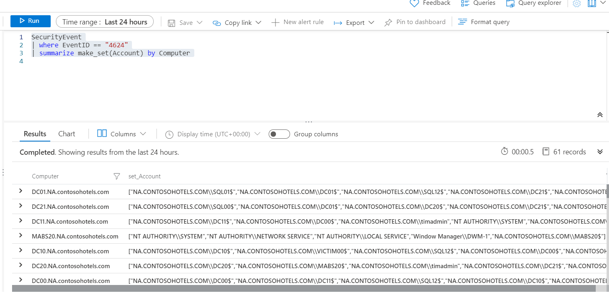

# KQL – SUMMARIZE & AGGREGATION

## 1. summarize Operator (Basics)
- Used to aggregate data into groups.
- Often paired with functions like `count()`, `dcount()`, `avg()`, `sum()`, etc.
- Output is grouped into new rows based on fields defined in the `by` clause.

### Examples:
```kusto
SecurityEvent | summarize by Activity
```

```kusto
SecurityEvent
| where EventID == "4688"
| summarize count() by Process, Computer
```

## 2. Common Aggregate Functions
- **count() / countif()** — total rows per group.
- **dcount() / dcountif()** — distinct values.
- **avg()** — average.
- **max() / min()** — highest / lowest value.
- **percentile()** — percentile estimation.
- **stdev()** — standard deviation.
- **sum()** — total sum.
- **variance()** — variance calculation.

### Example with renamed output column:
```kusto
SecurityEvent
| where TimeGenerated > ago(1h)
| where EventID == 4624
| summarize cnt = count() by AccountType, Computer
```

### dcount example:
```kusto
SecurityEvent
| summarize dcount(IpAddress)
```

## 3. Real-World Example — Invalid Password Failures
```kusto
let timeframe = 30d;
let threshold = 1;
SigninLogs
| where TimeGenerated >= ago(timeframe)
| where ResultDescription has "Invalid password"
| summarize applicationCount = dcount(AppDisplayName) by UserPrincipalName, IPAddress
| where applicationCount >= threshold
```

## 4. summarize with arg_max() / arg_min()

### arg_max() — Get most recent row per group:
```kusto
SecurityEvent
| where Computer == "SQL10.na.contosohotels.com"
| summarize arg_max(TimeGenerated, *) by Computer
```

### arg_min() — Oldest row per group:
```kusto
SecurityEvent
| where Computer == "SQL10.na.contosohotels.com"
| summarize arg_min(TimeGenerated, *) by Computer
```

## 5. Order of Pipe Operations Matters

### Statement 1:
```kusto
SecurityEvent
| summarize arg_max(TimeGenerated, *) by Account
| where EventID == "4624"
```
- Returns **accounts whose LAST recorded activity** was EventID 4624.

### Statement 2:
```kusto
SecurityEvent
| where EventID == "4624"
| summarize arg_max(TimeGenerated, *) by Account
```
- Returns the **most recent login (4624)** per account.

## 6. make_list() and make_set() — JSON Arrays

### make_list(): includes duplicates
```kusto
SecurityEvent
| where EventID == "4624"
| summarize make_list(Account) by Computer
```


### make_set(): unique values only
```kusto
SecurityEvent
| where EventID == "4624"
| summarize make_set(Account) by Computer
```



## 7. Visualizations — render Operator
```kusto
SecurityEvent
| summarize count() by Account
| render barchart
```

## 8. Creating Time Series — bin()
- `bin()` groups timestamps into intervals (example: 1d = 1 day).
- Common pattern before visualizing time charts.

### Example:
```kusto
SecurityEvent
| summarize count() by bin(TimeGenerated, 1d)
| render timechart
```
