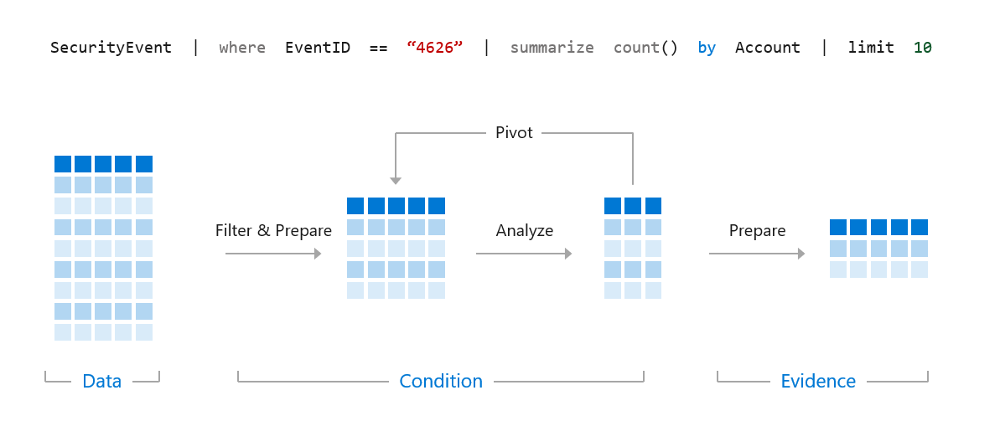
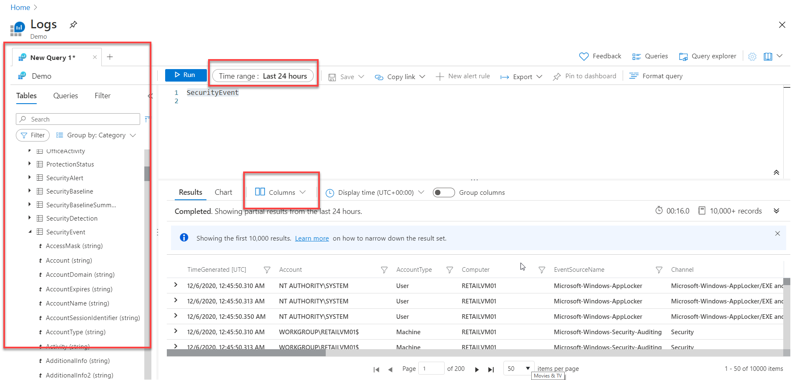

# KQL FUNDAMENTALS
## Kusto Query Language

# 1. What is KQL?
- Query language for Microsoft Sentinel & Defender XDR.
- Read-only, high-performance, used for hunting & analytics.
- Queries flow left → right using the pipe "|".'
  


# 2. Query Structure
- Start with a table → apply operators → output results.
- Everything left of "|" is processed first.

Example:
SecurityEvent
| where EventID == 4624
| summarize count() by Account
| take 10

# 3. Log Analytics Demo Environment
- Free Microsoft workspace for practicing KQL.
- Data changes constantly → adjust Time Range if needed (try 30+ days).



# 4. search Operator
- Searches all tables/columns.
- Easy but inefficient; use when you don’t know where data exists.

Examples:
```kusto
search "err"
```

```kusto
search in (SecurityEvent, SecurityAlert, A*) "err"
```

# 5. where Operator
- Filters rows based on conditions (most commonly used filter).

Examples:
```kusto
SecurityEvent
| where TimeGenerated > ago(1d)
```

```kusto
SecurityEvent
| where TimeGenerated > ago(1h) and EventID == 4624
```

```kusto
SecurityEvent
| where EventID in (4624, 4625)
```

```kusto
SecurityEvent
| where TimeGenerated > ago(1h)
| where AccountType =~ "user"
```

# 6. let Statement
- Creates reusable variables, lists, or mini-tables.
- Makes queries modular and readable.

Variables:
```kusto
let timeOffset = 7d;
let discardEventId = 4688;
SecurityEvent
| where TimeGenerated > ago(timeOffset*2)
| where EventID != discardEventId
```

Dynamic table:
```kusto
let suspiciousAccounts = datatable(account:string)
[
    @"\administrator",
    @"NT AUTHORITY\SYSTEM"
];
SecurityEvent
| where Account in (suspiciousAccounts)
```

Computed table:
```kusto
let LowActivityAccounts =
    SecurityEvent
    | summarize cnt = count() by Account
    | where cnt < 1000;

LowActivityAccounts
| where Account contains "SQL"
```

# 7. extend Operator
- Adds calculated columns.

Example:
```kusto
SecurityEvent
| where ProcessName != "" and Process != ""
| extend StartDir = substring(ProcessName, 0, string_size(ProcessName)-string_size(Process))
```

# 8. order by Operator
- Sorts results.
- Default sort order = descending.

Example:
```kusto
SecurityEvent
| extend StartDir = substring(ProcessName, 0, string_size(ProcessName)-string_size(Process))
| order by StartDir desc, Process asc
```

# 9. project Operators
- Control which columns appear in results.

project:
```kusto
SecurityEvent
| project Computer, Account
```

project with extend:
```kusto
SecurityEvent
| where ProcessName != "" and Process != ""
| extend StartDir = substring(ProcessName, 0, string_size(ProcessName)-string_size(Process))
| order by StartDir desc
| project Process, StartDir
```

project-away:
```kusto
SecurityEvent
| where ProcessName != "" and Process != ""
| extend StartDir = substring(ProcessName, 0, string_size(ProcessName)-string_size(Process))
| project-away ProcessName
```

# END OF NOTES

# Check your knowledge

1. What does the search operator do?
```
Searches across tables and isn't column-specific.
Correct
```

2. What are project operators?
```
Project operators add, remove, or rename columns in a result set.
Correct
```