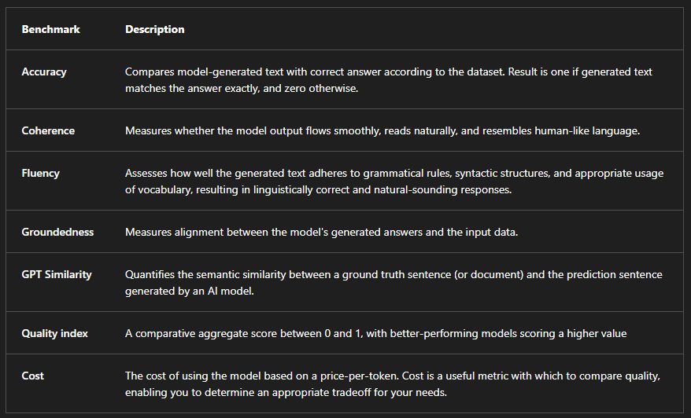
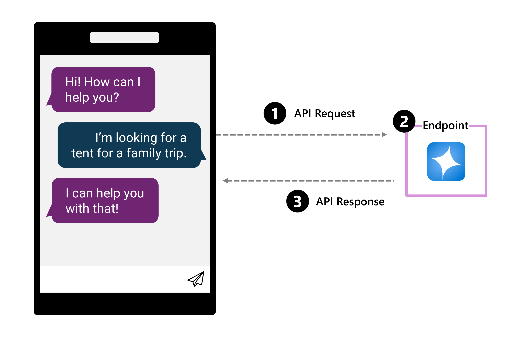
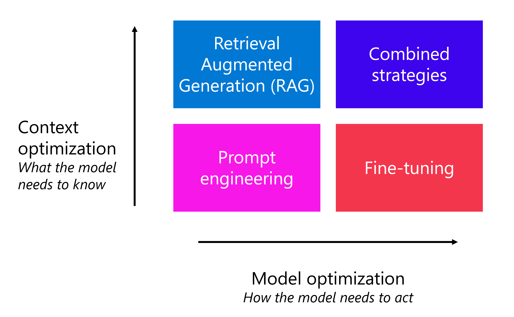

# Foundation models and deploying generative AI in Microsoft Foundry

## Foundation models overview
Foundation models (for example, the GPT family) are language models designed to understand, generate, and interact with natural language. Common use cases include speech-to-text and text-to-speech, machine translation, text classification, entity extraction, text summarization, question answering, and reasoning. In this module, the focus is on using foundation models for question answering in chat-style applications.

### Why Transformers matter (high-level)
Transformer architecture (Attention Is All You Need, 2017) enabled modern foundation models by (1) processing words in parallel using attention rather than strictly sequentially, and (2) using positional encoding to represent word position in a sentence in addition to semantic relationships.

## Model catalog in Microsoft Foundry
Microsoft Foundry’s model catalog is a central place to browse models and quickly deploy them for prototyping. A structured selection approach:
- Can AI solve my use case? (discover, filter, deploy a candidate model)
- How do I select the best model? (define criteria and compare)
- Can I scale for real-world workloads? (deployment, monitoring, prompt management, lifecycle)

### Model sources (catalogs)
- Hugging Face: large catalog of open-source models
- GitHub: models via marketplace and Copilot ecosystem
- Microsoft Foundry: integrated catalog with tooling for deployment and prototyping

## Choosing the right model (selection dimensions)

### LLMs vs SLMs
LLMs (examples: GPT-4, Mistral Large, Llama3 70B, Llama 405B, Command R+) are suited for deep reasoning, complex generation, and large-context needs.  
SLMs (examples: Phi3, Mistral OSS models, Llama3 8B) prioritize efficiency and cost, and are useful when speed/cost/edge constraints matter.

### Modality, task, or tool fit
- Chat completion models: optimized for coherent text responses (ex: GPT-4, Mistral Large)
- Reasoning models: targeted for harder reasoning tasks (examples given: DeepSeek-R1, o1)
- Multimodal models: accept text + images (examples: GPT-4o, Phi3-vision) for vision/document scenarios
- Image generation models: create images from prompts (examples: DALL·E 3, Stability AI)
- Embedding models: convert text to vectors for semantic search and similarity (examples: Ada, Cohere); often used in RAG to improve retrieval/recommendations
- Function calling / JSON support: useful for structured data workflows (API calls, DB queries, structured outputs)
- Code-Davinci: Optimized for code generation tasks and lacks the capabilities required for text generation

### Regional and domain specialization
Some models are optimized for specific languages/regions/industries (examples: Core42 JAIS for Arabic; Mistral Large for European languages; Nixtla TimeGEN-1 for time-series forecasting). Use specialized models when your app’s language/region/domain needs demand it.

### Open vs proprietary tradeoffs
- Proprietary models: best for cutting-edge performance and enterprise use (examples listed: OpenAI GPT-4, Mistral Large, Cohere Command R+)
- Open-source models: best for flexibility/cost and increased control (fine-tuning/customization/local deployment); available via the Foundry catalog from Hugging Face and vendors like Meta, Databricks, Snowflake, Nvidia
Using models through the Foundry model catalog supports enterprise requirements: data/privacy controls, security/compliance, responsible AI, and content safety.

## Selection criteria and evaluation

### Criteria to filter models
- Task type (text-only vs multimodal)
- Precision (base vs fine-tuned)
- Openness (ability to fine-tune yourself)
- Deployment (local, serverless endpoint, or managed infrastructure)

### Precision (in this module’s context)
Precision is described as accuracy of correct/relevant outputs and fewer incorrect/irrelevant outputs. Options:
- Base model (pretrained, broad capability; may lack domain precision)
- Fine-tuned model (trained further on task-specific dataset to improve precision and relevance)
Prompt engineering can help, but fine-tuning may be needed for domain-specific precision.

### Performance evaluation approaches
- Benchmarks in the model catalog help early comparisons but may not reflect your specific use case.
Common benchmark metrics listed: accuracy, coherence, fluency, groundedness, GPT similarity, quality index (0–1), and cost (price-per-token).
- Manual evaluations: quick quality assessment by rating responses
- Automated evaluations: scalable comparisons using your own ground truth (examples listed: precision, recall, F1)

## Scaling a generative AI solution (real-world)
Key scaling considerations:
- Model deployment (balance performance and cost)
- Model monitoring and optimization (evaluate and improve over time)
- Prompt management (orchestrate and optimize prompts for accuracy/relevance)
- Model lifecycle (manage model/data/code updates in a GenAIOps lifecycle)
Microsoft Foundry provides visual and code-first tools to help build and maintain scalable solutions.

# Deploying a model to an endpoint

## Why deploy a model?
To use a model in an app, you deploy it so the app can send input and receive output through an endpoint (a URL). Typical flow for chat apps:
API request → endpoint routes to deployed model → API response returns model output to the app.

## Deployment options in Microsoft Foundry
Deployment type depends on model and hosting choice:
- Standard deployment: model hosted in the Microsoft Foundry project resource (recommended for most scenarios)
- Serverless compute: model hosted in Microsoft-managed dedicated serverless endpoints in a Foundry hub project
- Managed compute: model hosted in managed VM images in a Foundry hub project

### Cost/billing model (as described)
- Standard deployment: token-based billing; supports Microsoft Foundry models (including Azure OpenAI + models-as-a-service)
- Serverless compute: token-based billing; supports Foundry models with pay-as-you-go billing
- Managed compute: compute-based billing; supports open and custom models

# Optimizing model performance (prompting + beyond)

## Prompt engineering
Prompt engineering is designing/optimizing prompts to improve response quality. Effective prompts are relevant, specific, unambiguous, and well-structured. Developers often use a system prompt to set behavior without exposing instructions to end users.

### Prompt patterns described
- Persona: instruct the model to respond from a specific role/perspective
- Ask for better question suggestions: have the model request clarifying info / improve the prompt
- Specify format: provide a template/structure for output
- Ask for explanation of reasoning: request reflection/rationale after the answer (described as chain-of-thought in the text)
- Add context: specify what to focus on/ignore; optionally connect to data sources for grounding context

## Additional optimization strategies (beyond prompt engineering)
- Retrieval Augmented Generation (RAG): retrieve grounding context from a data source before generating a response (useful for domain knowledge and post-training events)
- Fine-tuning: extend training with example prompts/responses to improve format/style/consistency
Guidance given: start with prompt engineering, then consider RAG/fine-tuning if needed due to added cost/complexity/maintainability.

# Module assessment answers

## Q1: Where can you test a deployed model in the Microsoft Foundry portal?
Answer: Chat playground

## Q2: You want to specify the tone, format, and content for each interaction with your model in the playground. What should you use?
Answer: System message

## Q3: What deployment option should you choose to host an OpenAI model in a Microsoft Foundry resource?
Answer: Standard deployment
