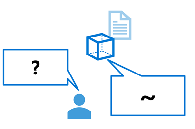
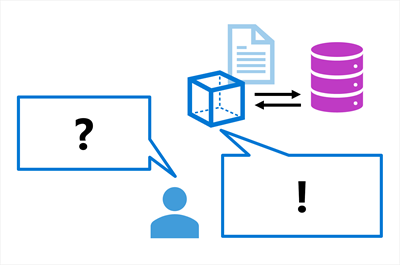
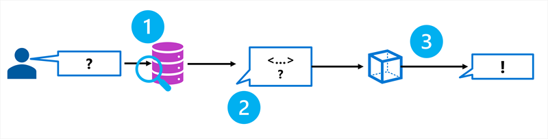
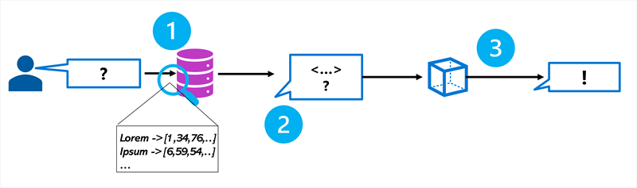
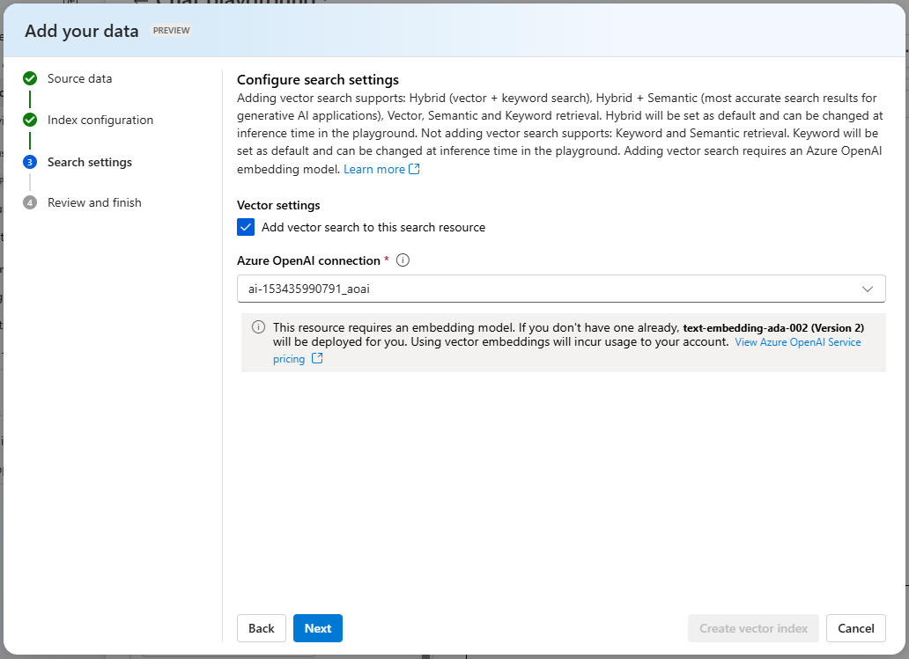
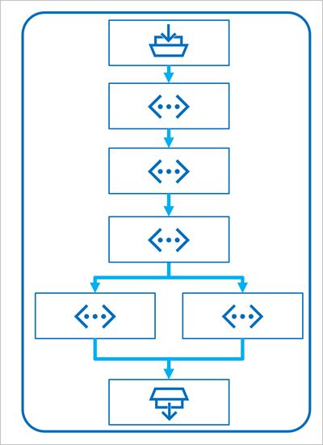
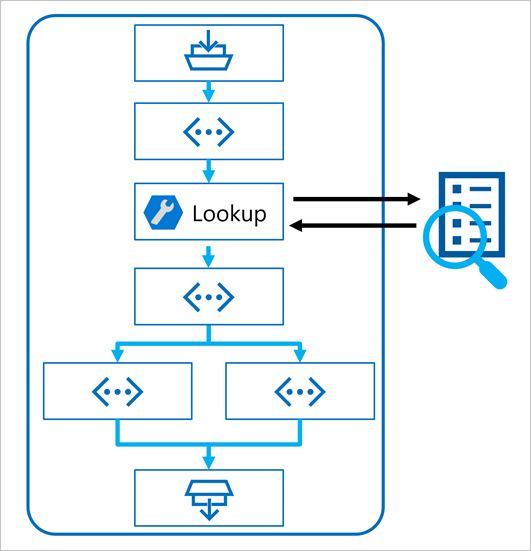
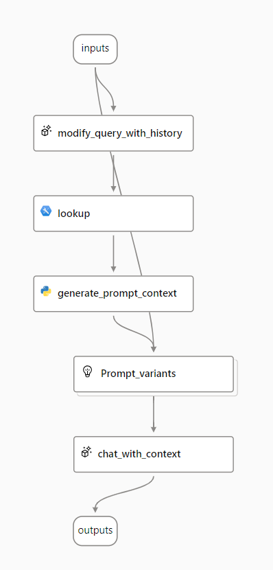

# Grounding language models with Retrieval Augmented Generation (RAG)

## Why grounding matters
Language models are strong at generating fluent, engaging text, but they may lack access to the specific or up-to-date knowledge required for a given use case. When building agents or chat-based applications, grounding ensures responses are factual, relevant, and aligned with domain-specific data rather than relying solely on the model’s training data.

## Example of Un-grounded Response


Grounding is commonly achieved using Retrieval Augmented Generation (RAG).

## Example of Grounded Response



## Understanding Retrieval Augmented Generation (RAG)
RAG is a pattern used to ground a language model by retrieving relevant information and injecting it into the prompt before generation. The general RAG process:
- Retrieve grounding data based on the user prompt
- Augment the prompt with the retrieved data
- Use a language model to generate a grounded response
By supplying retrieved context, the model generates responses based on authoritative data sources instead of only prior training.

## Adding grounding data in Microsoft Foundry
Microsoft Foundry supports grounding prompts using your own data by connecting data sources to a project. Supported data sources include:
- Azure Blob Storage
- Azure Data Lake Storage Gen2
- Microsoft OneLake
You can also upload files or folders directly to the storage associated with a Foundry project.

## Making data searchable with Azure AI Search
To ground an agent on your own data, the data must be searchable. Microsoft Foundry integrates with Azure AI Search to retrieve relevant context during chat flows.

Azure AI Search allows you to:
- Ingest your own data
- Create search indexes
- Query indexed data to retrieve grounding context
Azure AI Search acts as the retriever component in a RAG-based application.



## Vector indexes and embeddings
A vector-based index typically provides better retrieval quality than text-only indexes. Vector search uses embeddings, which are numerical vector representations of text tokens.


Embeddings capture semantic meaning rather than exact wording. Semantic similarity between documents and queries is calculated using cosine similarity between vectors. This enables retrieval of relevant content even when wording differs or languages vary.

To enable vector search:
- Create embeddings when building the search index
- Use an Azure OpenAI embedding model available in Microsoft Foundry
The resulting index stores embeddings and supports semantic retrieval.



## Creating a search index
A search index defines how content is structured to support efficient retrieval. In Microsoft Foundry, Azure AI Search integration simplifies index creation for language model use cases.

Index approaches include:
- Keyword search: exact term matching
- Semantic search: meaning-based retrieval
- Vector search: embedding-based similarity search
- Hybrid search: combines keyword, vector, and optional semantic ranking
For generative AI applications, hybrid search provides the most accurate and relevant results.



## Using RAG in a client application
After creating an Azure AI Search index, you can ground prompts by passing index connection details to the Azure OpenAI chat request. The request includes data source configuration so retrieved context is incorporated before generation.

Keyword-based RAG matches prompt text to indexed text. Vector-based RAG additionally uses embeddings by specifying an embedding model deployment in the request configuration.

## Create a RAG-based client application

```bash
from openai import AzureOpenAI

# Get an Azure OpenAI chat client
chat_client = AzureOpenAI(
    api_version = "2024-12-01-preview",
    azure_endpoint = open_ai_endpoint,
    api_key = open_ai_key
)

# Initialize prompt with system message
prompt = [
    {"role": "system", "content": "You are a helpful AI assistant."}
]

# Add a user input message to the prompt
input_text = input("Enter a question: ")
prompt.append({"role": "user", "content": input_text})

# Additional parameters to apply RAG pattern using the AI Search index
rag_params = {
    "data_sources": [
        {
            "type": "azure_search",
            "parameters": {
                "endpoint": search_url,
                "index_name": "index_name",
                "authentication": {
                    "type": "api_key",
                    "key": search_key,
                }
            }
        }
    ],
}

# Submit the prompt with the index information
response = chat_client.chat.completions.create(
    model="<model_deployment_name>",
    messages=prompt,
    extra_body=rag_params
)

# Print the contextualized response
completion = response.choices[0].message.content
print(completion)
```

## Implementing RAG in a prompt flow
Prompt flow orchestrates RAG using tools connected in a flow:
- Inputs: user question and optional chat history
- Index Lookup tool: retrieves relevant data from the search index
- Python tool (optional): parses and formats retrieved documents
- LLM tool: generates the response using augmented prompt context
- Outputs: grounded response returned to the user





## Chat flow with RAG (sample-based approach)
The Multi-round Q&A on your data sample demonstrates a full RAG-enabled chat flow:
- Combine chat history with the latest user question
- Retrieve relevant context from Azure AI Search
- Generate a prompt using retrieved content
- Apply prompt variants with different system messages
- Submit the grounded prompt to an LLM
- Return the generated response



## Prompt variants for groundedness
Variants allow multiple versions of a prompt or system message to be tested. When using RAG, variants help identify which instructions best enforce factual, grounded responses by explicitly directing the model to rely on retrieved context.

## Monitoring grounded responses
Evaluation metrics are used to assess grounded performance:
- Groundedness: alignment between output and source data
- Relevance: pertinence to the user input
- Coherence: logical flow and readability
- Fluency: grammatical correctness
- Similarity: semantic match to ground truth
If performance degrades, revert to experimentation and refine prompts, variants, or retrieval logic.

# Module assessment answers

## Q1: What does groundedness refer to in the context of generative AI?
Answer: Using data to contextualize prompts and ensure relevant responses.

## Q2: What pattern can you use to ground prompts?
Answer: Retrieval Augmented Generation (RAG).

## Q3: How can you use the RAG pattern in a client app that uses the Azure OpenAI SDK?
Answer: Add index connection details to the OpenAI ChatClient configuration.
