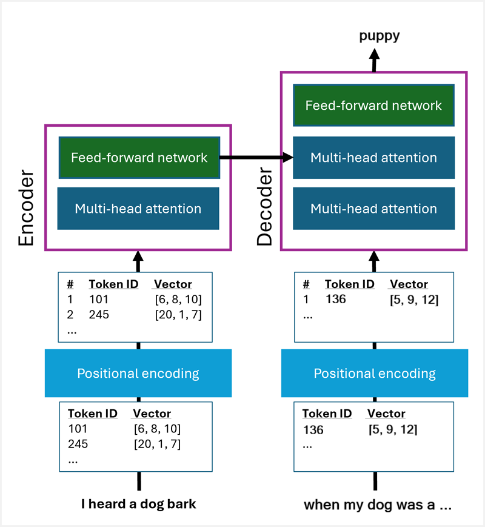
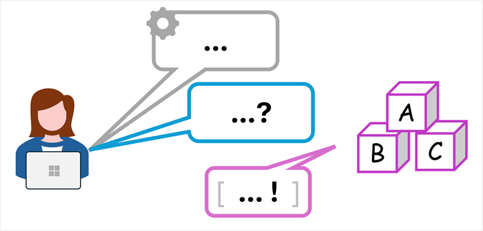
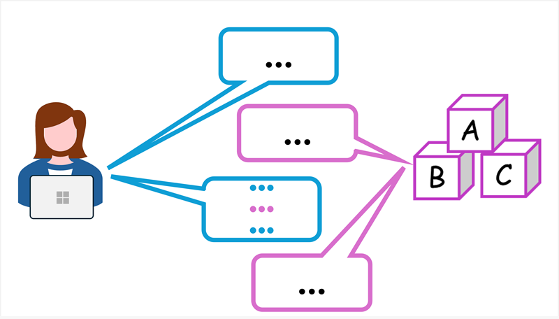
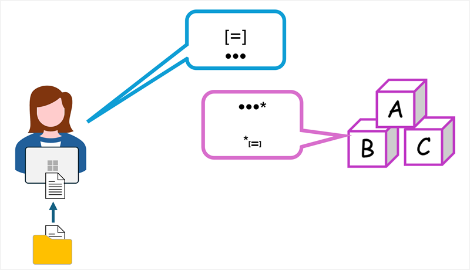
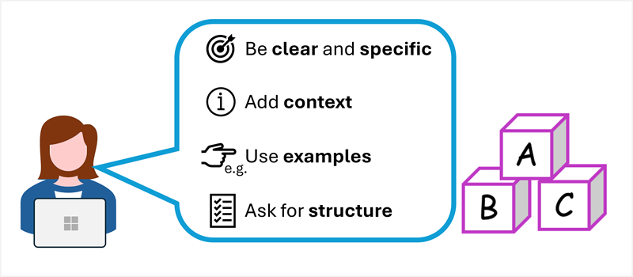
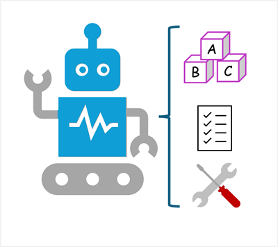
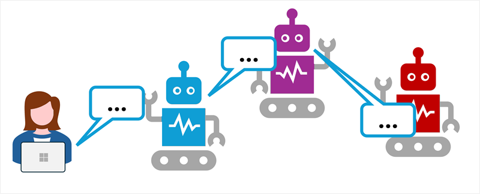

# AI-900 — LLMs, Prompts, RAG, & Agents (Condensed Notes)

## 1. Large Language Models (LLMs & SLMs)

- **LLMs/SLMs**:
      - Capture **linguistic + semantic relationships** between words/phrases
      - Core of **generative AI** → generate text, code, etc.

- **Trained objective**:
      - Predict next token given a **prompt** (advanced predictive text)

- **LLM vs SLM**:
      - **LLM** = large, general-purpose, powerful, higher cost
      - **SLM** = smaller, cheaper, focused on narrower domains

- Key capability:
      - Understand **context** and **relationships** between tokens to produce meaningful completions

## 2. Tokenization & Embeddings

### Tokenization

- Text is split into **tokens**:
      - Whole words, sub-words, punctuation, common character sequences
- Each token gets a **token ID** (integer)
- Models operate on **tokens**, not raw characters/words

### Embeddings (Vector Representations)

- Each token → vector (embedding):
      - High-dimensional numeric array (e.g., thousands of dimensions)
      - Encodes semantic + linguistic properties
- Tokens with similar meanings → **similar embeddings**
      - Similar direction in vector space (cosine similarity)

### Positional Encoding

- Models need **order** of tokens
- Positional encodings added so tokens “know” their position in sequence

## 3. Transformer Overview (High Level)

- Core architecture for modern LLMs: **Transformer**

### Encoder (for Embeddings)

- Uses **attention** (self-attention) to:
      - Look at token + surrounding tokens
      - Assign weights based on influence/importance
- **Multi-head attention**:
      - Multiple attention “heads” evaluate different aspects in parallel
- Produces enriched **embeddings** with context

### Decoder (for Generation)

- Uses embeddings + **masked attention**:
      - At training time: sees only previous tokens when predicting next
- Iterative generation:
      - Predict next token → append to sequence → repeat
      - Stops at end-of-sequence token

### Intuition

- Attention and embeddings:
      - Learns which tokens influence others in different contexts
      - E.g., in “I heard a dog bark”, “heard” + “dog” strongly inform “bark”

## 4. Prompts — How You Talk to LLMs

- **Prompt** = input you give the model
      - Question, instruction, or message
      - Model returns a **completion**

### Types of Prompts

- **System prompt**:
      - Sets **behavior, tone, and constraints** of the model
      - Example:
            “You are a helpful assistant that responds in a cheerful, friendly manner.”
      - Usually defined by the **application**

- **User prompt**:
      - Specific question or task
      - Example:
            “Summarize key generative AI adoption risks for executives in bullet points.”

- Model responds to **user prompts** while following **system prompt** rules

## 5. Conversation History

- Apps often include **previous messages + responses** in each new prompt:
      - Gives model **context** for follow-up questions
- Enables:
      - Multi-turn conversations
      - “Remembering” what was just discussed within that session

## 6. Retrieval Augmented Generation (RAG)

- **Goal**:
      - Ground responses in **external knowledge** (docs, emails, databases)
      - Improve **accuracy**, **freshness**, and **domain-specificity**

### RAG Flow (Simplified)

1. User asks a question:
      - e.g., “What’s my company’s travel expense limit?”
2. App **retrieves** relevant content:
      - Search internal policy docs, knowledge base, etc.
3. App builds an **augmented prompt**:
      - Original question + key excerpts from retrieved docs
4. LLM uses this context to generate a **grounded answer**

- Benefits:
      - Less hallucination
      - Answers tailored to **your** data and policies

## 7. Prompting Best Practices (Exam-Ready)

- **Be clear and specific**:
      - Explicit instructions > vague requests
- **Add context**:
      - Audience, purpose, tone, constraints
- **Use examples**:
      - Show desired style if you care about formatting
- **Ask for structure**:
      - Bullet points, tables, numbered steps, etc.
- Good prompts can **dramatically** improve output quality

## 8. AI Agents — Next Step Beyond Chat

### What is an AI Agent?

- Software built on generative AI that can:
      - Understand & generate **natural language**
      - Use **tools** to take actions
      - React to **context/conditions** (not just answer questions)

### Components of an Agent

1. **LLM**:
      - “Brain” for reasoning and language

2. **Instructions (System Prompt)**:
      - Defines role & behavior
      - Example:
            “You are a travel assistant that books flights following company policy.”

3. **Tools**:
      - **Knowledge tools**:
            - Search, databases, document APIs
      - **Action tools**:
            - Send emails, update calendars, trigger workflows, call APIs

- Agents = **LLM + Instructions + Tools**

## 9. Multi-Agent Systems

- Multiple agents with **different roles** collaborate:
      - Example:
            - Agent A → find data
            - Agent B → analyze data
            - Agent C → take actions (e.g., send report)
- Agents communicate via **prompts** to each other
- Behave like an **AI team**, automating complex workflows

## 10. Key Exam Takeaways (Quick Recall)

- LLMs generate text via **next-token prediction** over **tokens**.
- **Tokens → embeddings** via transformers + attention.
- Transformer = encoder (embeddings) + decoder (generation).
- **Prompts**:
      - System = behavior/context
      - User = specific task
- **RAG** adds external data to prompts for grounded answers.
- **Agents**:
      - LLM + system instructions + tools
      - Can act, not just chat
      - Multi-agent systems handle complex chained tasks.
