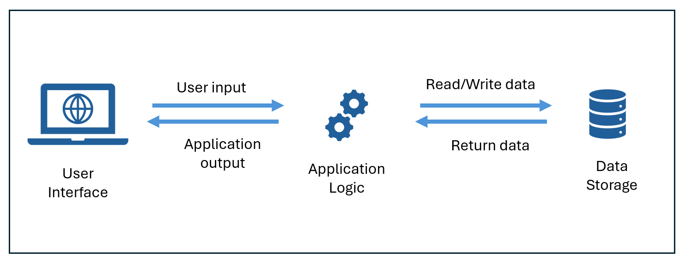
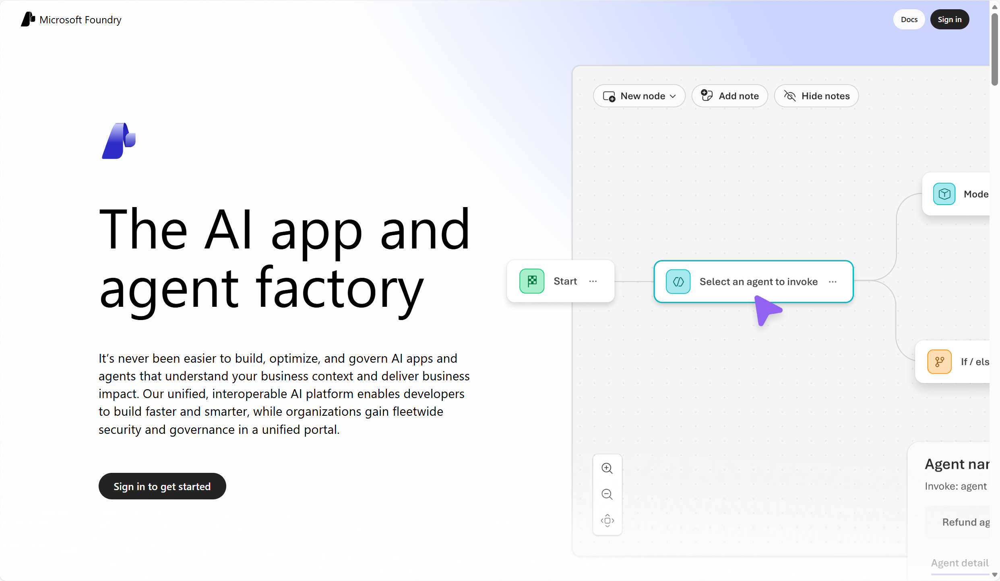
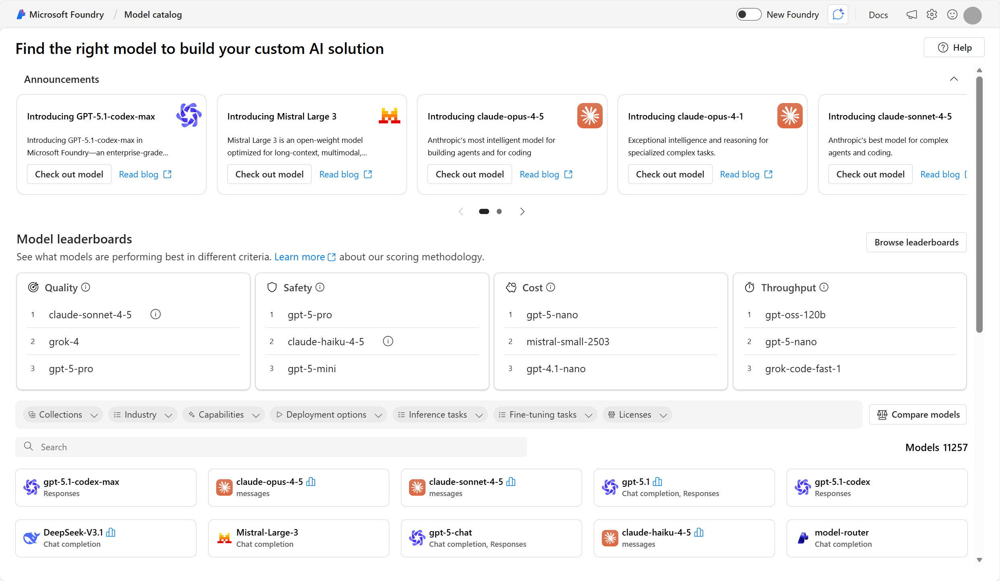
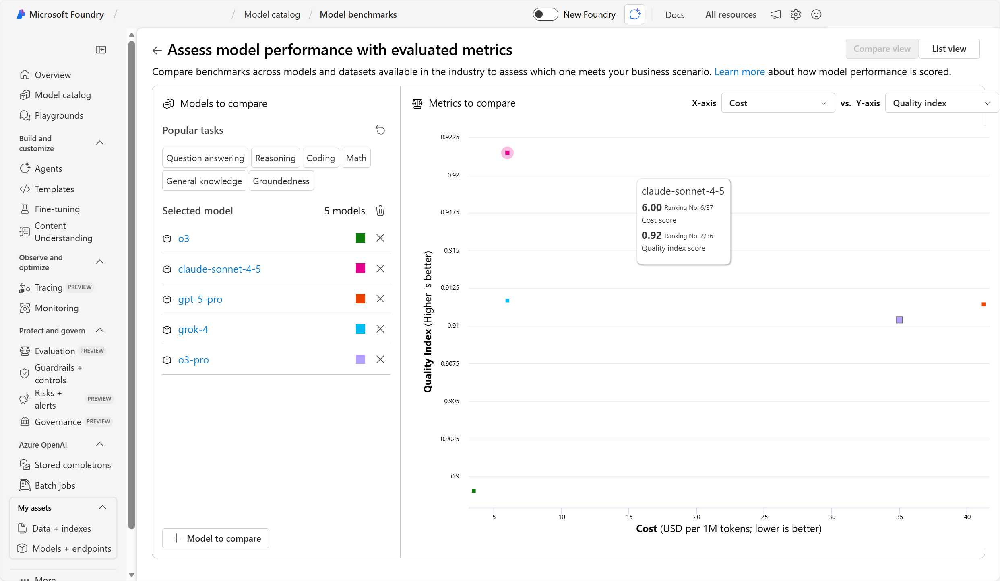
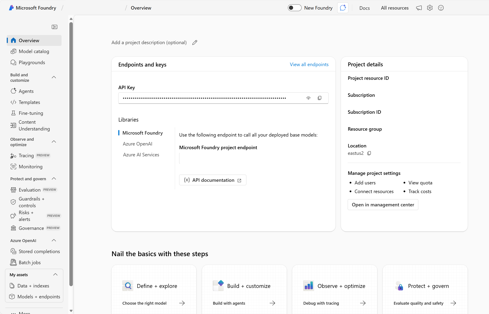
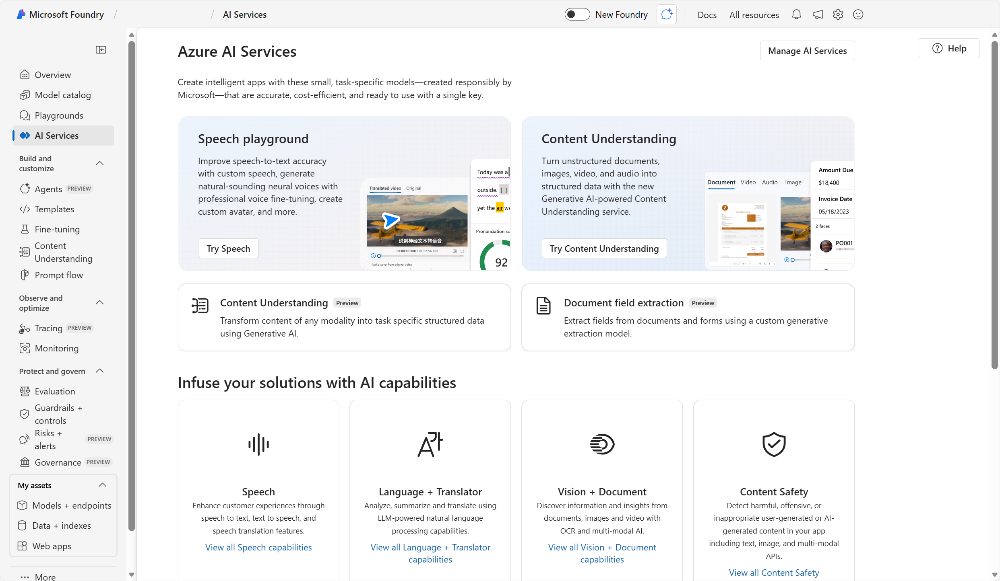

# AI-900 — Generative AI Apps, Foundry & Observability (Condensed Notes)

## 1. Generative AI Applications — Big Picture

- Built around **language models** (LLMs/SLMs)
- Models power the **“app logic”**:
      - Understand user input
      - Generate responses
      - Call tools / APIs
- Often exposed as:
      - **Assistants** (chat-based helpers)
      - **Agents** (task-executing systems)

## 2. Assistants vs Agents

### Assistants

- Chat-based helpers embedded in apps
- Example: **Microsoft Copilot**
      - Integrated across Microsoft 365 & other experiences
      - Helps with:
            - Writing, summarizing, transforming content
            - Automating routine productivity tasks
- Main role: **help users interact with information** and create content faster

### Agents

- More autonomous than simple chat assistants
- Can **take actions** (not just answer questions)
      - Example: “Executive assistant” agent:
            - Reads your calendar
            - Finds meeting location
            - Adds map
            - Books taxi / rideshare

- Core components:
      1. **Language model** (reasoning + language understanding)
      2. **Instructions** (goals, behavior, constraints)
      3. **Tools** (functions/APIs to perform tasks)

### Orchestration

- Real-world AI apps mix:
      - Assistants, agents, traditional logic, data sources, tools, workflows
- **Orchestration** = coordinating all AI components to work as one solution

## 3. Categories of Generative AI Applications

1. **Ready-to-use applications**
      - No programming needed
      - You just start prompting
      - Example: out-of-the-box Copilot experiences

2. **Extendable applications**
      - Ready-to-use, but can be **customized** with your data/processes
      - Example: Microsoft Copilot extended with:
            - Plugins
            - Custom data
            - Business workflows

3. **Applications you build from the foundation**
      - Start from a **base model** (foundation model)
      - Build your own assistants/agents and end-to-end solutions

- Typically use services like:
      - **Copilot Studio** → extend Microsoft 365 Copilot (low-code)
      - **Microsoft Foundry** → build richer, custom AI apps & agents

## 4. Microsoft Foundry — Overview

- **Platform-as-a-Service (PaaS)** for:
      - Enterprise AI operations
      - Model builders
      - Application & agent development
- Gives you:
      - Control over **model choice/customization**
      - Cloud deployment & scaling
      - Integration with your apps

### Core Foundry Components

- **Model catalog**
      - Discover / compare / deploy models (Microsoft + partners/community)
      - Includes **Azure OpenAI** foundation models
      - Models can often be used:
            - As-is
            - Customized (grounding, RAG, fine-tuning)

- **Playgrounds**
      - Quick test environments to:
            - Try prompts
            - Experiment with models
            - Compare behavior

- **Foundry Tools**
      - Prebuilt ML tools (APIs) you can demo & deploy:
            - Azure Speech
            - Azure Language
            - Azure Vision
            - Content Safety
            - Others

- **Solutions**
      - Build **agents**, apps, and pipelines
      - Customize models and integrate with tools

- **Observability**
      - Monitor usage & performance
      - Evaluate quality, safety, reliability of responses

## 5. Foundry Model Catalog & Leaderboards

- Catalog includes:
      - **Microsoft foundation models** (e.g., Azure OpenAI)
      - Partner and community models

- Foundation models:
      - Pretrained on large corpora
      - Can be:
            - Deployed **without extra training**
            - **Customized** for domain tasks

- Choosing a model:
      - Try models in **playgrounds**
      - Use **leaderboards** (preview) to compare:
            - Quality
            - Cost
            - Throughput
      - View graphical comparisons across metrics

## 6. Foundry Hubs, Projects & Tools

### Hubs & Projects Structure

- **Azure AI Hub**:
      - Top-level container for AI resources
      - When you create a hub, you also get:
            - Foundry Tools resource
            - Supporting infra (storage/compute, etc.)

- **Projects**:
      - Created inside hubs
      - Focused spaces for:
            - Specific models
            - Agents
            - Applications

### Foundry Tools & Playgrounds

- In Foundry, you can:
      - Test Foundry Tools (speech, language, vision, content safety)
      - Use **playgrounds** to:
            - Chat with models
            - Explore tool behavior
            - Prototype interactions quickly

## 7. Ways to Customize Models in Foundry

### 1. Grounding Data

- **Grounding** = tying outputs to **factual, contextual sources**
      - Databases
      - Knowledge bases
      - Search results
      - Domain docs
- Goal:
      - More accurate, trustworthy, and relevant responses

### 2. Retrieval-Augmented Generation (RAG)

- Connect model to **your own data**
- Workflow:
      - Retrieve relevant data from proprietary sources
      - Inject retrieved info into prompt
      - Model generates responses based on this context
- Great for:
      - Customer support
      - Knowledge management
      - Domain-specific Q&A with up-to-date info

### 3. Fine-tuning

- Further train a **pretrained foundation model** on **task/domain-specific data**
- Benefits:
      - Specialized behavior
      - Better accuracy on niche tasks
      - More consistent domain-specific answers

### 4. Security & Governance Controls

- Control:
      - Access & authentication
      - Data usage policies
      - Compliance & guardrails
- Purpose:
      - Protect sensitive data
      - Prevent unauthorized or inappropriate outputs
      - Maintain governance over AI usage

## 8. Observability in Generative AI (Foundry)

- **Observability** = monitoring & evaluating:
      - Quality
      - Safety
      - Performance of AI outputs

### Three Evaluation Dimensions

1. **Performance & Quality evaluators**
      - Accuracy
      - Groundedness
      - Relevance

2. **Risk & Safety evaluators**
      - Detect harmful or inappropriate content
      - Assess risk exposure (toxicity, bias, etc.)

3. **Custom evaluators**
      - Domain/industry-specific metrics
      - Tailored to organizational goals

### Common Evaluators in Foundry

- **Groundedness**
      - Measures how well the response matches provided context/docs

- **Relevance**
      - How well the response answers the user query

- **Fluency**
      - Natural language quality & readability

- **Coherence**
      - Logical consistency & flow

- **Content Safety**
      - Checks for safety concerns:
            - Hate, violence, self-harm, sexual content, etc.

- Observability helps:
      - Improve model behavior over time
      - Build **trust** in generative AI solutions

## 9. Exam-Speed Recap

- Generative AI apps:
      - Use LLMs as core logic
      - Exposed via assistants & agents
- Agents:
      - LLM + instructions + tools
      - Can take actions (not just answer)
- App categories:
      - Ready-to-use
      - Extendable
      - Built-from-foundation
- Microsoft Foundry:
      - PaaS for building, customizing, and deploying generative AI
      - Model catalog + tools + playgrounds + observability
- Customization methods:
      - Grounding
      - RAG
      - Fine-tuning
      - Security/governance
- Observability:
      - Evaluators for quality (groundedness, relevance, fluency, coherence)
      - Safety (content safety)
      - Custom metrics for domain use
