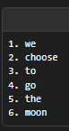
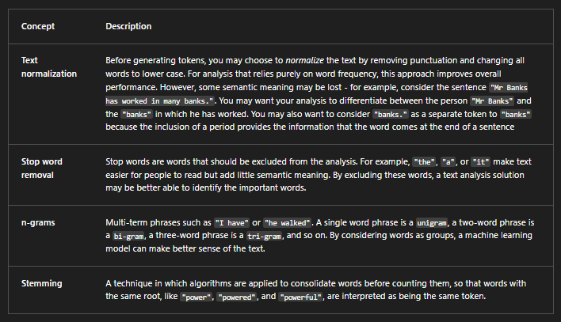
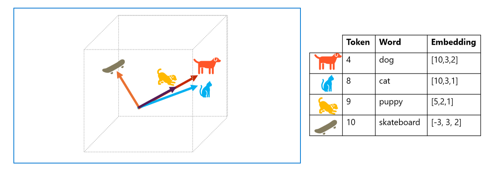
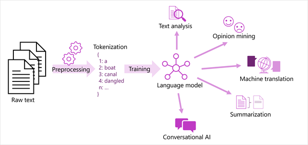
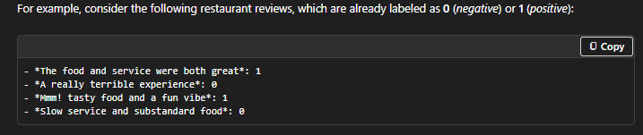
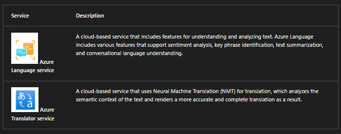
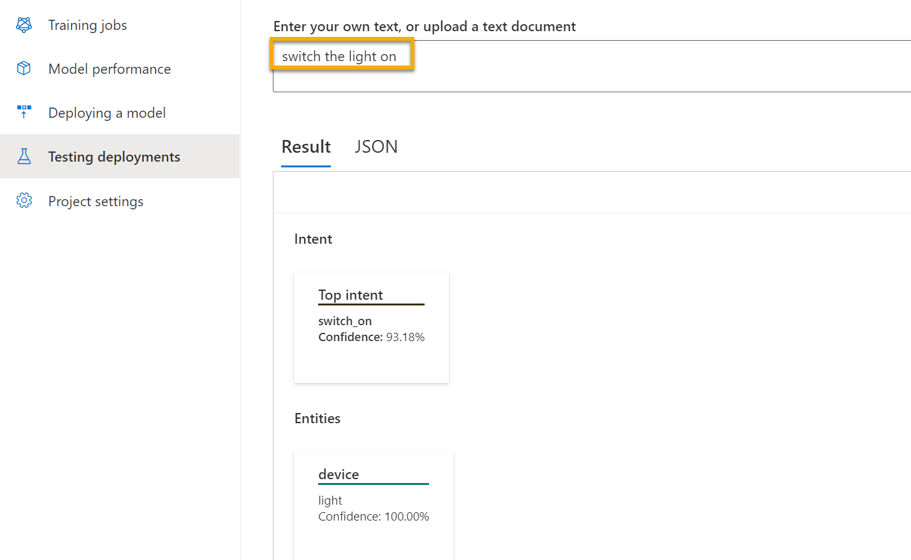
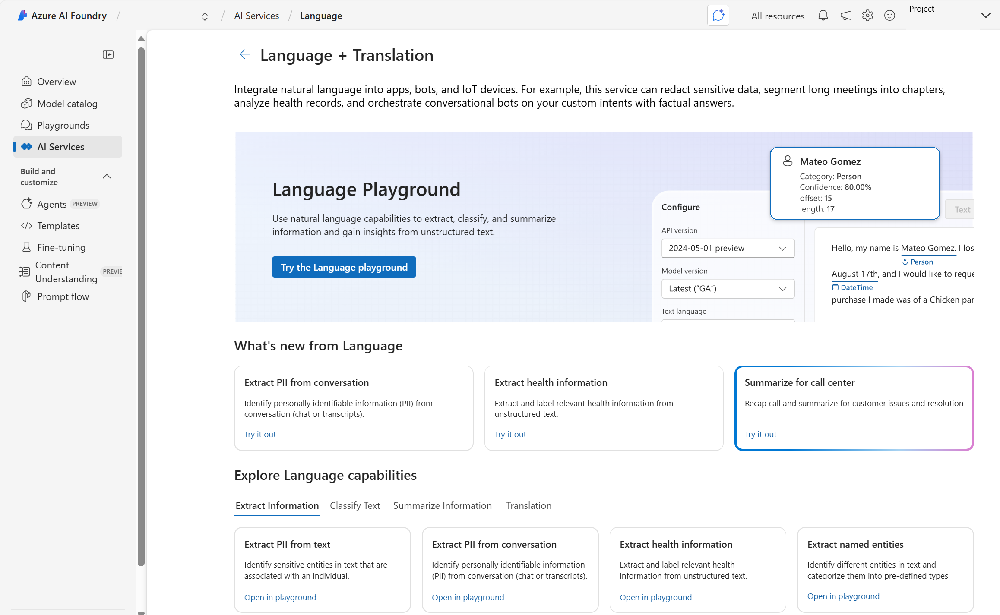
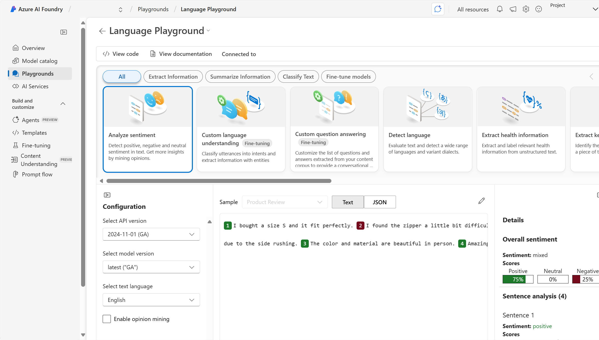
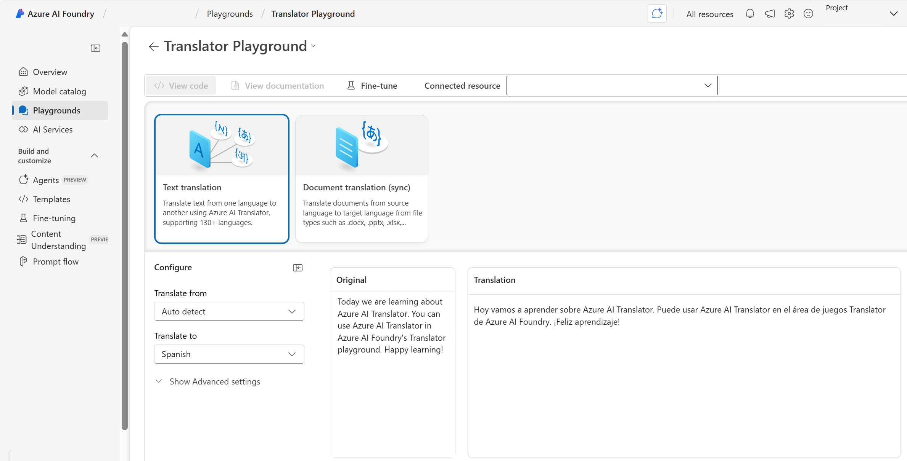

# UNDERSTAND HOW LANGUAGE IS PROCESSED — AI-900 NOTES (COPY/PASTE READY)

## TOKENIZATION
Tokenization = breaking text into smaller units (tokens).  
Example: “we choose to go to the moon”  
Tokens → {we, choose, to, go, to, the, moon}

Key concepts:
- Text normalization → lowercasing, removing punctuation (may lose meaning)
- Stop-word removal → remove common words (“the”, “a”, “it”)
- n-grams → multi-word tokens (bi-grams, tri-grams, etc.)
- Stemming → reduce words to root form (“power”, “powered”, “powerful” → “power”)

---

# STATISTICAL NLP TECHNIQUES

## NAÏVE BAYES
- Early NLP statistical classifier.
- Used for spam detection.  
- Learns which words strongly correlate with spam vs. not spam.
- Bag-of-words approach → position of words is ignored.

Example spam indicators:
- “miracle cure”
- “lose weight fast”
- “anti-aging”

## TF-IDF
Term Frequency – Inverse Document Frequency  
Purpose: Identify which words are *important* in a document *relative* to a larger set of documents.

High TF-IDF =  
- Appears frequently in *one* doc  
- Appears infrequently *across all* docs  

Used for:
- Information retrieval
- Document classification
- Search weighting

Example:  
JFK "moon speech" → common bigram “the moon” → topic = space exploration.

---

# SEMANTIC LANGUAGE MODELS

## EMBEDDINGS
Tokens are converted into multidimensional vectors.  
Vectors encode **semantic meaning** based on context.

Example simplified vectors:
- dog → [10, 3, 2]  
- cat → [10, 3, 1]  
- puppy → [5, 2, 1]  
- skateboard → [-3, 3, 2]

Interpretation:
- dog, cat, puppy → similar direction → semantically related  
- skateboard → unrelated → very different vector direction  

Modern models:
- Use thousands of dimensions
- Use transformer architecture + attention
- Produce embeddings that capture contextual relationships

## NLP MODEL TRAINING PIPELINE
Corpus → Tokenization → Embedding → Model training → NLP tasks  
(Language generation, classification, summarization, etc.)

---

# MACHINE LEARNING FOR TEXT CLASSIFICATION

Technique:
- Use algorithms like logistic regression
- Train on labeled text (examples with categories)

Example — Sentiment analysis:
Positive (1):
- “The food and service were both great”
- “Mmm! tasty food and a fun vibe”

Negative (0):
- “A really terrible experience”
- “Slow service and substandard food”

Model learns:
- Words like “great”, “tasty”, “fun” → positive  
- Words like “terrible”, “slow”, “substandard” → negative  

Used for:
- Product reviews  
- Support ticket triage  
- Customer feedback analysis  
- Social media monitoring  

# AI-900 — Natural Language Processing on Azure

## 1. Core NLP Tasks on Azure
Azure supports several natural language processing tasks, including:
- **Language detection**
- **Sentiment analysis**
- **Named entity recognition (NER)**
- **Text classification**
- **Translation**
- **Summarization**

These are powered by Foundry Tools such as:
- **Azure Language Service**
- **Azure Translator Service**

---

## 2. Azure Language — Text Analysis Capabilities

### Named Entity Recognition (NER)
Identifies people, places, events, quantities, dates, URLs, and more.

**Examples of entity types:**
- **Person:** “Bill Gates”
- **Location:** “Paris”
- **Organization:** “Microsoft”
- **Quantity:** numbers, percentages, currency, dimensions, temperature
- **Date/Time:** specific dates, ranges, durations
- **URL / Email / Phone / IP Address**

### Entity Linking
Maps recognized entities to canonical entries (e.g., Wikipedia).

**Example:**
Text: *“I ate at the restaurant in Seattle last week.”*  
Entities detected:
- **Seattle → Location → https://en.wikipedia.org/wiki/Seattle**
- **last week → DateRange**

---

## 3. Language Detection
Returns:
- **Language name**
- **ISO 639-1 code** (en, es, fr, etc.)
- **Confidence score**

**Examples:**
| Review | Detected Language | Code | Score |
|--------|-------------------|------|--------|
| "A fantastic place..." | English | en | 1.0 |
| "Comida maravillosa..." | Spanish | es | 1.0 |
| "croque monsieur avec frites..." | English | en | 0.9 |

Mixed-language text → identifies *predominant* language.  
Ambiguous text (e.g., “:-)”) → returns **unknown**.

---

## 4. Sentiment Analysis & Opinion Mining
Evaluates text and computes sentiment scores:
- **Positive**
- **Neutral**
- **Negative**

**Example:**
Review: “...food was amazing.”  
- Positive: 0.90  
- Neutral: 0.10  
- Negative: 0.00  
→ **Overall sentiment: Positive**

Review: “...service was slow, food was awful.”  
→ **Overall sentiment: Negative**

---

## 5. Key Phrase Extraction
Identifies **main ideas** in unstructured text.

**Example review phrases:**
- birthday celebration  
- fantastic experience  
- friendly hostess  
- great food  
- attentive service  
- ambiance  

Useful for summaries, review mining, survey analysis.

---

## 6. Azure Language — Conversational AI Capabilities

### Question Answering
- Build AI assistants that respond using a knowledge base.
- Supports natural, multi-turn conversations.
- Used in chatbots, help centers, customer service.

### Conversational Language Understanding (CLU)
Interprets user intent + extracts key information.

**Example command:**  
“Turn the light off”  
→ Intent: **TurnOffDevice**  
→ Entity: **light**

Used for:
- Voice assistants
- Home automation
- Support bots
- Command/control systems

---

## 7. Azure Translator Capabilities

### Neural Machine Translation (NMT)
Understands:
- Context  
- Grammar  
- Idioms  
- Formal vs informal tone  

Supports **130+ languages**.

### Translator Features
- **Text translation** (real-time)
- **Document translation** (preserves formatting)
- **Custom translation models** (industry-specific vocab)

Also available through:
- Microsoft Foundry
- Microsoft Translator Pro (mobile for enterprise)

---

## 8. Getting Started in Microsoft Foundry Portal

### Resource Options
- **Language resource** — NLP only  
- **Translator resource** — translation only  
- **Foundry Tools resource** — bundle of AI services  

### Foundry Portal Features
- Organized by **projects**
- Provides:
  - Language Playground (NER, sentiment, summarization)
  - Translator Playground (text translation)
- Easy testing + development

---

## 9. Workflow in Foundry Portal
1. Create a **Foundry Tools project**
2. Access AI services (Language, Translator, etc.)
3. Test capabilities in playgrounds
4. Integrate via SDKs or REST APIs

