# INFORMATION EXTRACTION – KEY EXAM NOTES (AI-900)

## OVERVIEW
- Information extraction = OCR + semantic field extraction.
- Goal: convert documents (PDFs/images/scans) into structured data fields.
- Examples: receipts → Vendor, Date, Total; invoices → Invoice#, Due Date, Line Items.

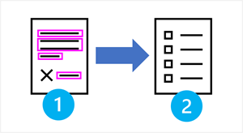

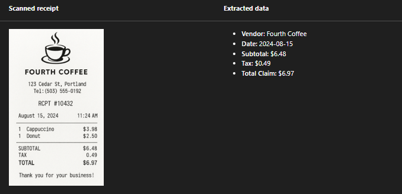

## WHEN TO USE WHAT
- Consistent layouts → template-based extraction.
- Many layouts/variations → ML or generative AI–based extraction.
- High-volume workloads → cloud automation.
- Sensitive data → strict security + compliance.
- Real-time needs → simpler models; batch → complex models OK.

## OCR – ESSENTIAL PIPELINE

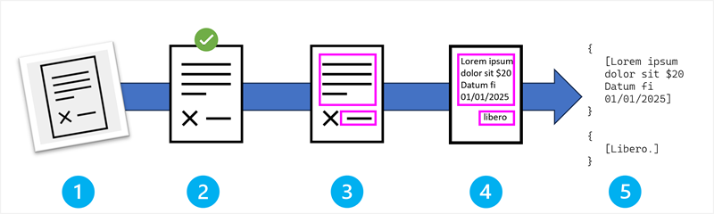

1. Image Acquisition  
   - Source: scans, photos, PDFs, screenshots, video frames.

2. Preprocessing  
       - Noise reduction  
       - Contrast adjustment  
       - Skew correction  
       - Resolution optimization  

3. Text Region Detection  
       - Find text blocks, lines, paragraphs.  
       - Identify layout structure.  
       - Determine reading order.

4. Character Recognition  
       - Feature extraction → shapes of characters.  
       - Pattern recognition → maps shapes to characters.  
       - Language model → context-based correction.

5. Output + Post-Processing  
       - Compile characters → words → lines.  
       - Preserve layout (when needed).  
       - Apply spell/grammar checks.  
       - Return text + coordinates + confidence scores.

## FIELD EXTRACTION – OVERVIEW
- After OCR, map text → meaningful business fields.
- Uses:
  - Templates
  - Machine learning models
  - Generative AI (schema-based prompting)

## FIELD EXTRACTION PIPELINE

1. OCR Output Ingestion  
   - Takes text, coordinates, confidence, structure.

2. Field Detection  
       - Template-based: keywords + expected positions.  
       - ML-based: learns layout patterns from training data.  
       - GenAI: prompt-based extraction using schemas.

3. Field Mapping  
       - Proximity pairing (label: value).  
       - Spatial alignment (columns, rows).  
       - Table extraction when documents include line items.  
       - Confidence scoring + validation checks.

4. Normalization  
       - Standardize formats (dates, currency, casing).  
       - Remove noise.  
       - Validate against rules (ranges, mandatory fields).

5. Integration  
       - Map extracted fields → schemas/APIs/DBs.  
       - Convert into downstream formats.  
       - Produce confidence reports + error summaries.

## KEY TAKEAWAYS FOR EXAM
- OCR ≠ field extraction → two separate processes.  
- Preprocessing dramatically improves accuracy.  
- Templates good for fixed layouts; ML/GenAI good for variable layouts.  
- Field extraction relies heavily on text **position**, not just text content.  
- Azure services that provide these capabilities:
       - Azure Document Intelligence  
       - Azure Content Understanding (Foundry Tools)

# AZURE AI SERVICES FOR INFORMATION EXTRACTION – KEY EXAM NOTES (AI-900)

## CORE SERVICES
Azure Vision Image Analysis
- Extracts image insights: captions, tags, object detection, OCR.
- Best for photos, simple documents, business cards, menus, small scans.

Azure Content Understanding
- Multimodal generative AI analysis (documents, audio, images, video).
- Schema-based extraction (flexible, customizable).
- Great for invoices, audio summaries, meeting insights.

Azure Document Intelligence
- Deep form-processing engine; prebuilt models (receipts → tax forms).
- Custom model support with labeled documents.
- Best for complex, structured forms.

Azure AI Search
- Index + search engine using AI skills.
- Can extract text, tags, metadata, OCR, sentiment, entities.
- Ideal for knowledge mining, DAM, searchable archives.

Use services individually or combine them for:  
- Data capture  
- Business process automation  
- Meeting summarization  
- Digital asset management  
- Knowledge mining  

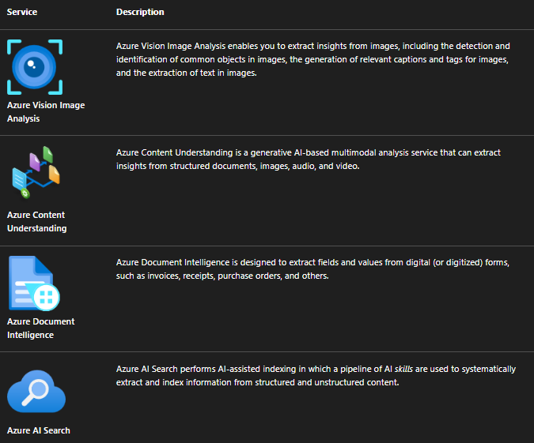

# AZURE VISION IMAGE ANALYSIS – CAPABILITIES

## Captions + Dense Captions
- Generates a single caption + multiple detailed object-level captions.
- Example (image: man walking dog):  
  - Caption: “A man walking a dog on a leash”  
  - Dense captions: man walking, dog on leash, yellow car, booth, etc.

## Object Detection
- Detects common objects + bounding boxes.  
- Example: apple, banana, orange → boxes + labels.

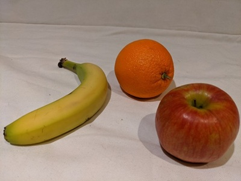

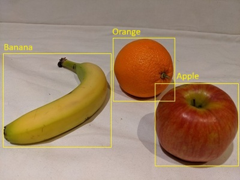

## OCR
- Detects + extracts printed/handwritten text.
- Good for small documents, business cards, menus.
- Returns:
  - Text lines  
  - Word-level text  
  - Coordinates  

Example output:
- Adventure Works Cycles  
- Roberto Tamburello  
- Engineering Manager  
- roberto@adventure-works.com  
- 555-123-4567  

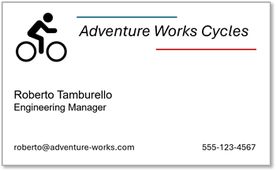
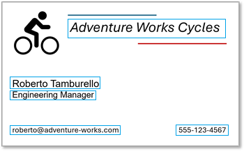
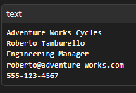

# AZURE CONTENT UNDERSTANDING – MULTIMODAL EXTRACTION

## Document Analysis (schema-based)
- Extracts fields even with:
  - inconsistent labels  
  - varied layouts  
  - unlabeled fields  
- Example invoice extraction:
  - Vendor  
  - Invoice number/date  
  - Customer details  
  - Line items  
  - Subtotal, tax, shipping, total  

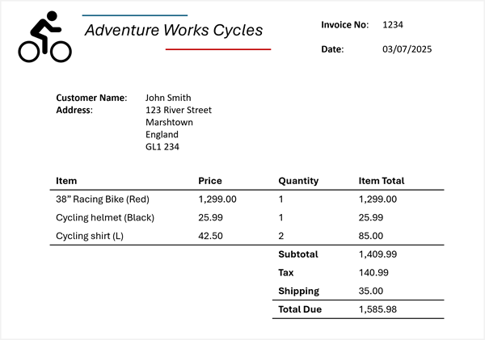

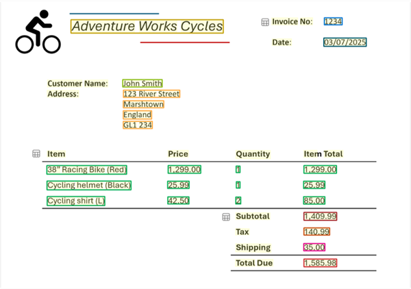

## Audio Analysis
- Transcription + summarization + schema extraction.  
- Example voicemail:
  - Caller: Ava  
  - Summary: follow-up, pricing OK  
  - Action: call/email  
  - Phone + email extracted  

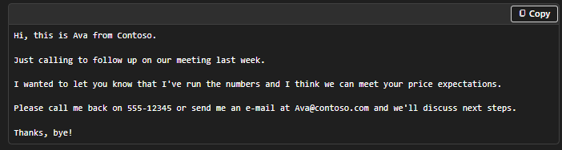

## Image & Video Analysis
- Custom schemas for:
  - Attendance counting  
  - Location  
  - Participant analysis  
- Example meeting snapshot:
  - In-person: 1  
  - Remote: 3  
  - Total: 4  

# AZURE DOCUMENT INTELLIGENCE – FORM PROCESSING

## Prebuilt Models
- Receipts, invoices, W-2, mortgage applications, etc.
- Extract complex fields: full names, SSNs, income, employer data, etc.

## Custom Models
- Train with labeled samples.
- Ideal for domain-specific documents.

# AZURE AI SEARCH – KNOWLEDGE MINING

## Indexers
- Automate:
  - Data ingestion  
  - Document cracking (extract text/images)  
  - Running AI skills (Vision, Language, Document Intelligence)  
  - Index creation  

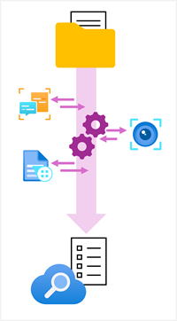

## Knowledge Store (optional)
- Persist extracted data to Azure Storage as:
  - Tables  
  - Images  
  - JSON structures  

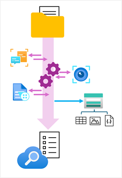

## Use Cases
- Searchable document libraries  
- Enterprise knowledge mining  
- Digital asset management  
- Automated metadata extraction  

