# AI-900 — Computer Vision & Image Generation Cheat Sheet

## 1. Core Computer Vision Tasks

### Image Classification
- Input: **one image → one label**
- Model predicts **main subject** of image
- Example: “apple”, “orange”, “banana” for grocery smart checkout
- Use when you care about **what** is in the image, not **where**

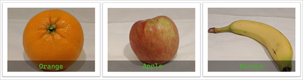

### Object Detection
- Input: one image → **multiple labels + locations**
- Output: list of objects + **bounding boxes** (x,y,width,height)
- Example: checkout camera detects apple, orange, banana on the same scale
- Use when you care **what & where** objects are

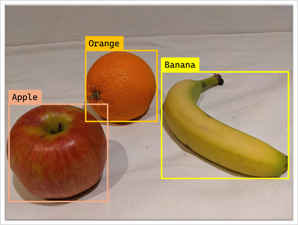

### Semantic Segmentation
- Classifies **each pixel** into a class
- Output: **mask** for each object/class, far more precise than bounding boxes
- Use when you need pixel-level detail:
      - Self-driving cars (roads vs sidewalks vs signs)
      - Medical imaging (tumor boundaries)

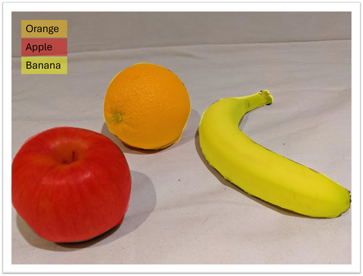

### Contextual / Multimodal Image Analysis
- Model can:
      - Understand **relationships** between objects + scene
      - Generate **captions, tags, explanations**
- Example: “A person eating an apple in a park” from an image
- Part of modern **multimodal** (vision + language) capabilities

---

## 2. How Images Are Represented

### Grayscale Image
- Stored as **2D array** (matrix) of pixel values:
      - Size = height x width (e.g., 7 x 7)
      - Pixel range usually **0–255** (0 = black, 255 = white)

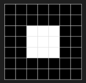

### Color Image (RGB)
- 3 channels: **Red, Green, Blue**
- Stored as **3D array**: (height x width x 3)
- Each channel has own 2D matrix of pixel values:
      - Example (R,G,B):
            - Purple square ≈ (R=150, G=0, B=255)
            - Yellow square ≈ (R=255, G=255, B=0)

---

## 3. Filters & Convolution

### Filter / Kernel
- Small matrix (e.g., **3x3**) applied to image
- Example kernel:

      -1  -1  -1
      -1   8  -1
      -1  -1  -1

- Operation: **convolution**:
      - Slide kernel over image
      - Multiply + sum each overlapping 3x3 patch
      - Store result in new image (feature map)

### Effects
- Different kernels → different effects:
      - Edge detection (like the Laplace filter shown)
      - Blur
      - Sharpen
      - Emboss
- Values outside 0–255 get clamped/scaled
- Edges often need **padding** (e.g., zeros) to keep size consistent

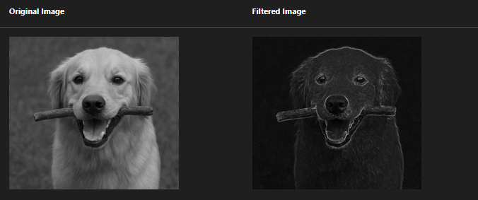

---

## 4. Convolutional Neural Networks (CNNs)

### Purpose
- Deep learning architecture specializing in **vision**
- Learns to extract visual features from raw pixels via **convolutions**

### High-Level Flow (Image Classification)
1. **Input**: image + known label (e.g., 0=apple, 1=banana, 2=orange)
2. **Convolution layers**:
      - Use many filters/kernels → produce **feature maps**
      - Start with random weights; trained to detect edges, textures, shapes
3. **Pooling layers**:
      - Downsample (e.g., max pooling) → smaller feature maps
      - Focus on most important features
4. **Flatten**:
      - Convert feature maps to a single 1D vector
5. **Fully connected layers**:
      - Classic neural network using extracted features
6. **Output layer**:
      - Softmax (or similar) output: probability for each class
      - Example: [0.2, 0.5, 0.3] → class 1 (banana)

### Training
- Compare predicted probs vs true label (e.g., banana = [0,1,0])
- Compute **loss** (error)
- Backpropagation:
      - Adjust weights in:
            - Convolution filters
            - Fully connected layers
- Repeat for many epochs until performance is good

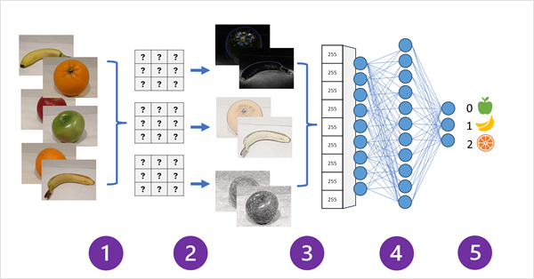

---

## 5. Vision Transformers (ViT) & Multimodal Models

### Transformers for Language (Quick Recap)
- Language models:
      - Encode **tokens** (words/subwords) to high-dimensional **embeddings**
      - Use **attention** to learn relationships between tokens in context
      - Similar tokens → similar embedding directions in vector space

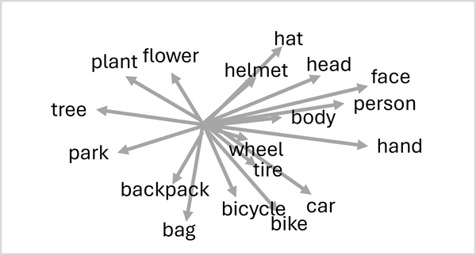

### Vision Transformers (ViT)
- Apply transformer idea to **images**:
      - Split image into **patches** (e.g., 16x16 pixel blocks)
      - Flatten each patch → vector
      - Use **attention** to understand relationships between patches
            - Learn features like color, texture, edges, shapes
- Result: **vision embedding space**:
      - Visually similar features → similar directions in vector space
      - E.g., patches related to “hat” often near patches related to “head” etc.

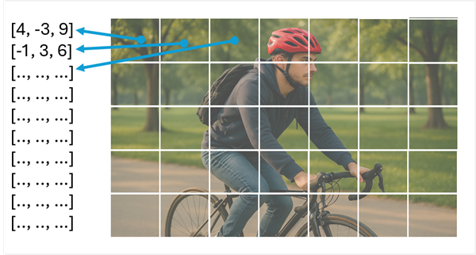

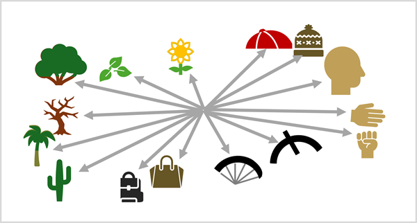

### Multimodal Models (Vision + Language)
- Combine:
      - **Language transformer** (text embeddings)
      - **Vision transformer** (image embeddings)
- Use **cross-modal attention** to learn relationships:
      - “dog”, “stick”, “park” ↔ corresponding visual features
- Enables:
      - Image captioning (“A dog carrying a stick in a park”)
      - Visual question answering (VQA)
      - Tagging, description, and search across images/videos

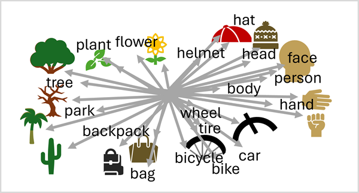

---

## 6. Image Generation (Diffusion Models)

### Core Idea
- Use multimodal model: **text** ↔ **visual features**
- Given a text prompt → model knows which visual features to activate
- Image generation is usually done with **diffusion models**

### Diffusion Process (Intuition)
1. Start with **random noise** (static).
2. Iteratively “denoise”:
      - At each step, slightly structure the pixels closer to what the prompt describes.
      - The model checks: "Does this look more like the prompt?"
3. After many steps → a coherent image that matches the prompt.

- Example prompt: **“A dog carrying a stick in its mouth”**
      - Early steps: fuzzy shapes and colors
      - Later steps: clear dog shape, stick, correct pose, coherent background

### Video Generation
- Similar approach, but:
      - Must respect **physics** (e.g., feet on ground, motion continuity)
      - Must handle **time** so frames flow logically
- Result: short clips / scenes that visually match the text description

---
# Exam Day Quick Reminders

- **Image classification**: one main label per image.
- **Object detection**: labels + bounding boxes.
- **Semantic segmentation**: pixel-level classification (masks).
- **Image representation**: arrays of pixel values (grayscale = 2D, RGB = 3D).
- **Filters / kernels**: convolved over image → edge detection, blur, etc.
- **CNN**: convolutions + pooling → flattened → fully connected → softmax.
- **ViT**: image → patches → attention → vision embeddings.
- **Multimodal**: shared space for text + vision → captions, VQA, multimodal reasoning.
- **Diffusion**: noisy image → iterative denoising guided by text prompt → final image (or video).

# AI-900 — Azure Vision & Foundry Tools Cheat Sheet

## 1. Foundry Tools & Azure Vision Overview
- **Azure Vision** = cloud computer vision service (prebuilt + custom models).
- Exposed as a **Foundry Tool** inside **Microsoft Foundry**.
- Two main products mentioned:
  - **Image Analysis** – captions, tagging, object detection, OCR.

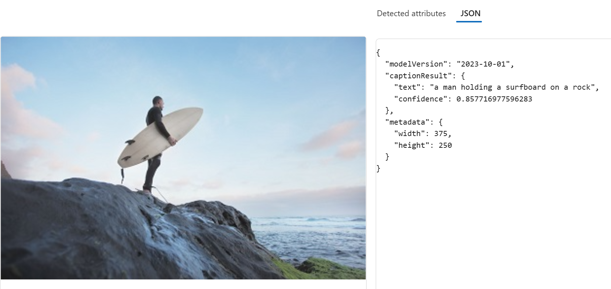

  - **Face** – face detection + advanced facial analysis/recognition.

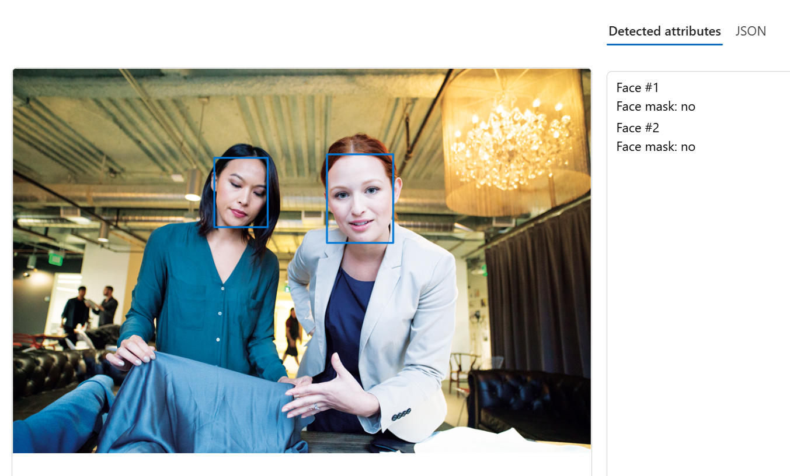
---

## 2. Azure Vision Image Analysis – Core Capabilities

### a. Image Captioning
- Generates **natural-language description** of an image.
- Example: skateboarder → “A person jumping on a skateboard”.

### b. Object Detection
- Detects **common objects** + **confidence score**.
- Returns **bounding box** (top, left, width, height).
- Use when you need both **what** and **where**.
- 
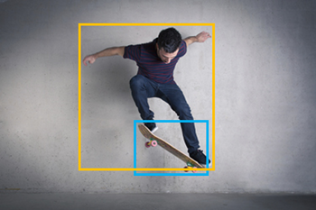

### c. Tagging Visual Features
- Returns **tags + confidence** (metadata) for search/indexing.
- Example tags for skateboarder: `sport`, `person`, `skateboarding`, `stunt`, `outdoor`, etc.
- Great for **search, SEO, and content organization**.

### d. OCR (Optical Character Recognition)
- Extracts **text from images** (labels, documents, signs, etc.).
- Output is plain text (e.g., nutrition label → full text lines).
- Used for:
  - Digitizing documents
  - Search/index
  - Automated document processing

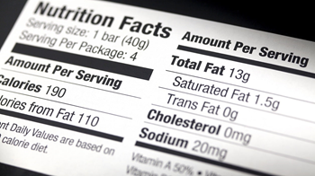

### e. Custom Models (Built on Foundation Model)
- If prebuilt doesn’t fit, you can train:
  - **Custom image classification** – 1 label per image (e.g., apple vs banana vs orange).
  - **Custom object detection** – multiple labeled objects + bounding boxes.
- Built on top of **pretrained foundation model** → fewer images needed.

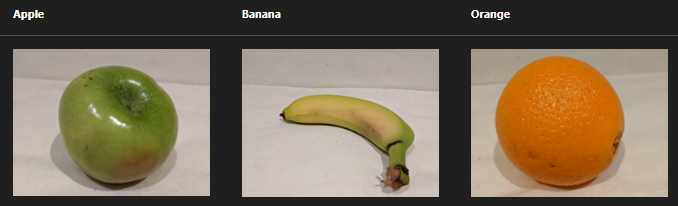

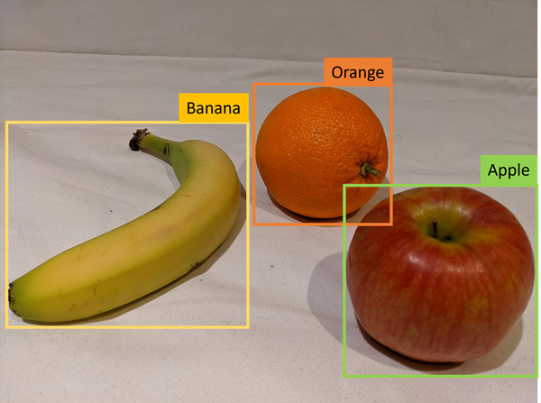
---

## 3. Azure AI Face – Key Capabilities

### Face Detection
- Finds **face locations** → bounding boxes.
- Can also return **landmarks** (eyes, nose, mouth, etc.).

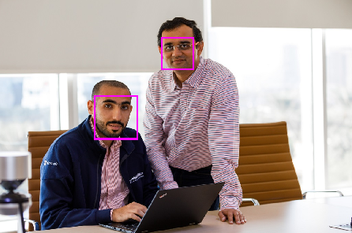

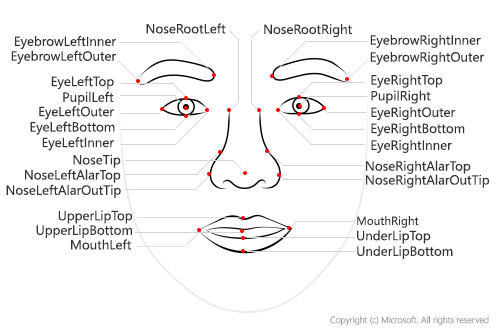

### Attributes Face Can Return
- **Accessories** (headwear, glasses, masks) + confidence.
- **Blur / Noise / Exposure** – image quality indicators.
- **Glasses** – wearing or not.
- **Head pose** – face orientation (3D).
- **Mask** – mask present or not.
- **Occlusion** – objects blocking parts of the face.
- **QualityForRecognition** – high/medium/low suitability for recognition.

### Face Recognition (Limited Access Features)
- **Face verification** – compare two faces for similarity.
- **Face identification** – identify known individuals.
- **Liveness detection** – detect real vs spoofed input.
- These require **Limited Access approval** (intake form) due to **Responsible AI** policies.

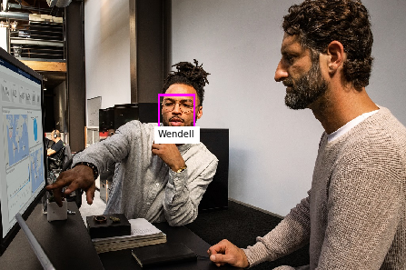

---

## 4. Responsible AI & Limited Access Policy
- Anyone can use Face for:
  - Detecting face rectangles.
  - Glasses / blur / noise / exposure / head pose / mask / occlusion.
- **Extra capabilities (verification, identification, liveness)** → Limited Access only.
- Aligns with **Microsoft Responsible AI Standard**.

---

## 5. Using Azure Vision in Microsoft Foundry

### Resource Types
- **Azure Vision resource**
  - Vision-only, separate billing/management.
- **Foundry Tools resource**
  - Bundles Azure Vision with other services:
    - Azure Language, Custom Vision, Translator, Speech, etc.
  - Good when using **multiple AI services** together.

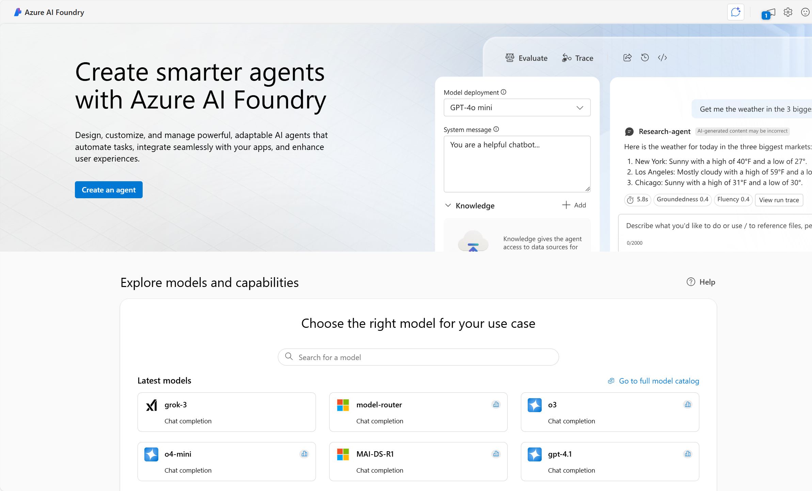

### Foundry Portal Concepts
- **Hubs & Projects**:
  - Create an **AI Hub** → includes Foundry Tools resource.
  - Create **Projects** in Foundry to organize:
    - Datasets, models, endpoints, experiments.
- In Microsoft Foundry you can:
  - Try **Vision demos** with sample or uploaded images.
  - Use **playgrounds** to experiment with Image Analysis and Face features.
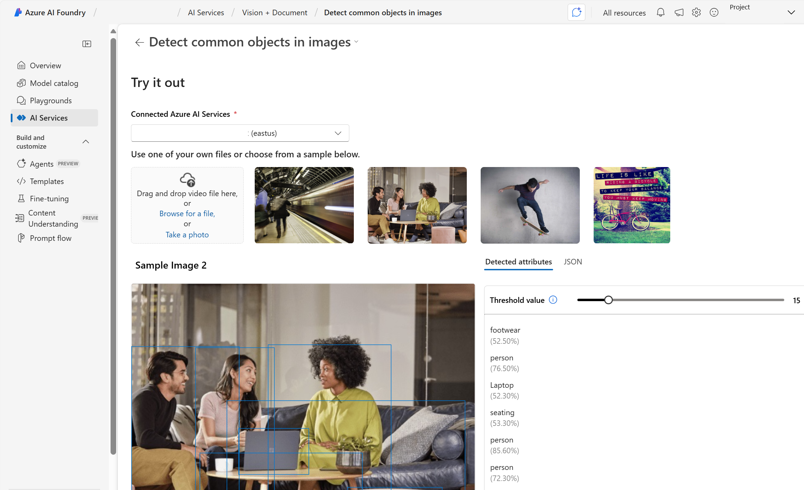
---

# Exam Day Nuggets

- **Image Analysis**: captions, object detection, tags, OCR, + custom models.
- **Face service**: face detection + attributes; recognition & liveness = **restricted** (Limited Access).
- **Azure Vision vs Foundry Tools** resource:
  - Vision-only vs multi-service bundle.
- **Responsible AI**: facial recognition/verification is tightly controlled via Limited Access.
