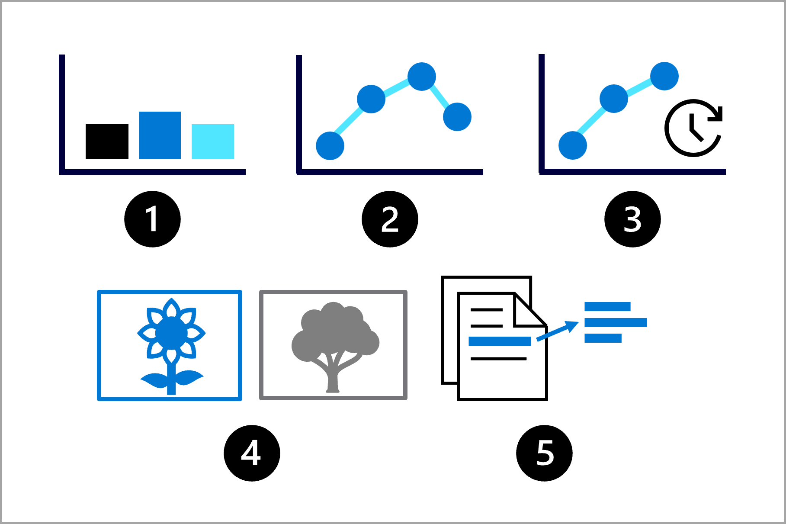
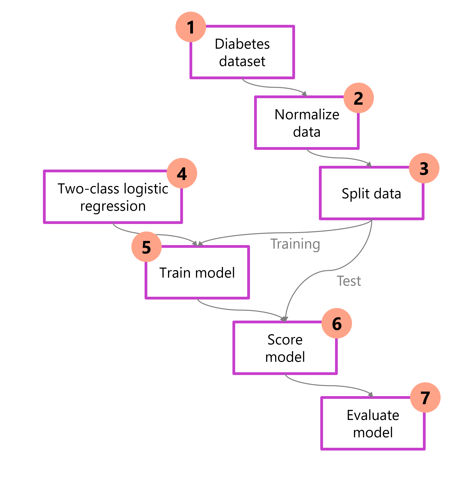
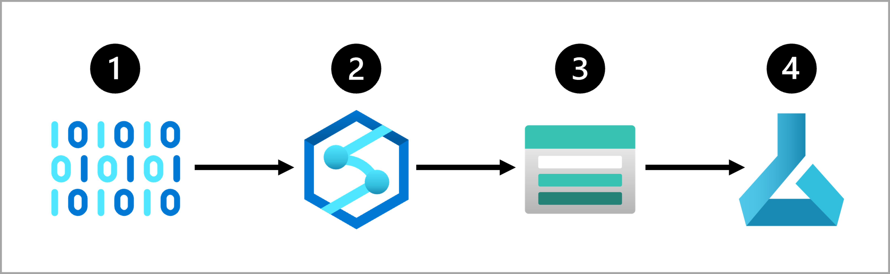
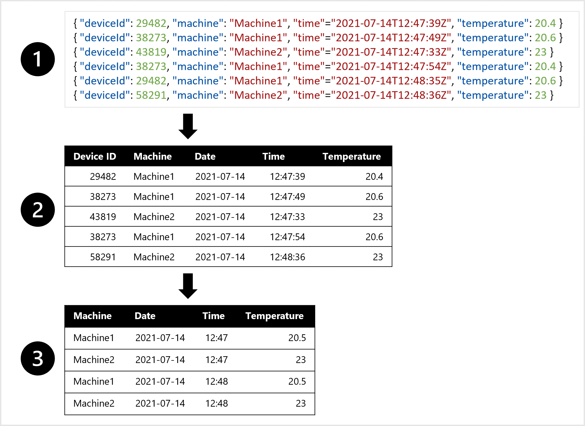
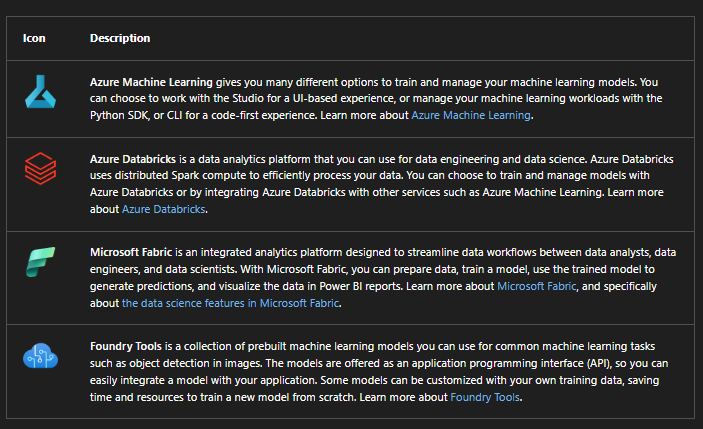
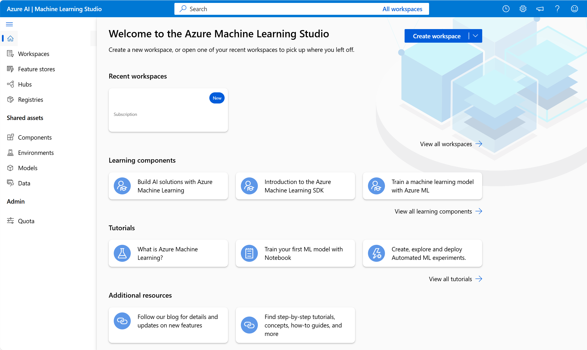
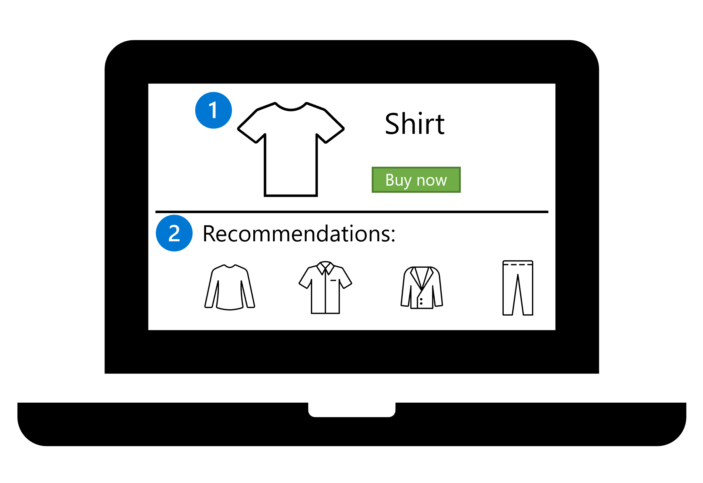
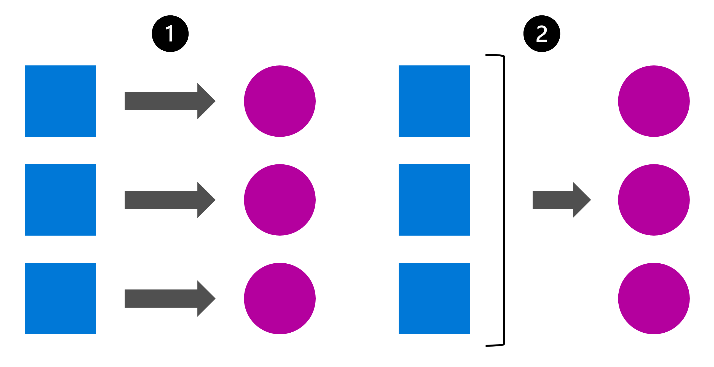

# AI-900 — ML Lifecycle & Azure ML (Condensed Notes)

## 1. Define the Problem

- Clarify:
      - What output should the model produce?
      - Which ML task fits?
      - How you’ll measure “success” (metrics).

### Common ML Tasks

- **Classification** → predict a **category** (yes/no, class label).
- **Regression** → predict a **numeric** value.
- **Time-series forecasting** → predict **future numeric values over time**.
- **Computer vision** → classify/detect objects in images.
- **NLP** → extract insights from text (classification, sentiment, entities, etc.).

### Example: Diabetes Prediction

- Data: patient health metrics (features).
- Output: diabetic vs not diabetic → **categorical**.
- Task: **classification** (binary).

## 2. Standard ML Workflow (Big-Picture)

1. **Load data** → import / inspect.
2. **Preprocess data** → clean, normalize, handle missing values.
3. **Split data** → train vs test (and sometimes validation).
4. **Choose model** → pick algorithm & settings.
5. **Train model** → learn patterns from training data.
6. **Score model** → generate predictions on test data.
7. **Evaluate** → metrics (accuracy, precision, recall, etc.).

- Training is **iterative**: repeat steps with different features/algorithms/params.

## 3. Get & Prepare Data

### 3.1 Identify Data Source & Format

- **Source examples**:
      - CRM systems
      - SQL / transactional DBs
      - IoT devices / telemetry

- **Formats**:
      - Structured/tabular (tables)
      - Semi-structured (JSON, logs)
      - Unstructured (images, audio, text, video)

### 3.2 Data Ingestion & ETL/ELT

- Common pattern:
      - **Extract Raw Data** data from source
      - **Copy & Transform Data with Azure Synapse Analytics** (clean, aggregate, shape)
      - **Store Data in Azure Blob Storage**
      - **Load to Train Azure Machine Learning** into serving layer (for ML)
- Often called **ETL** or **ELT**.

### 3.3 Azure Data Ingestion Tools

- **Azure Synapse Analytics** → pipelines, data integration, transformation.
- **Azure Databricks** → Spark-based data engineering & prep.
- **Azure Machine Learning** → pipelines & data prep for ML.

### Typical Pipeline Example

- Extract raw data (e.g., from CRM or IoT).
- Copy/transform with **Synapse** or **Databricks**.
- Store prepared data in **Azure Blob Storage** (or Lake).
- Train model with **Azure Machine Learning**.

### Weather Forecast Example (IoT)

- Raw: JSON temperature readings from IoT.
- Convert JSON → table.
- Aggregate to get **average temperature per hour/machine**.
- Result: clean tabular dataset ready for **time-series forecasting**.

## 4. Train the Model — Azure Services

### 4.1 Azure ML-Related Services

- **Azure Machine Learning**
      - Full ML lifecycle: data → train → deploy → manage
      - UI (Studio) or code-first (Python SDK / CLI)

- **Azure Databricks**
      - Spark-based analytics & ML
      - Can integrate with Azure ML for model management/deployment

- **Microsoft Fabric**
      - Unified analytics platform (lakehouse, notebooks, ML, Power BI)
      - End-to-end: prep data, train model, serve predictions, report in Power BI

- **Foundry Tools**
      - Prebuilt ML APIs (e.g., object detection)
      - Easy app integration; some allow custom training with own data

### 4.2 Azure Machine Learning — Capabilities

- Centralized datasets for training/evaluation
- On-demand **compute** for training / jobs
- **AutoML** for automated model selection & tuning
- Visual **pipelines** for training & inferencing workflows
- Integration with frameworks like **MLflow**
- Built-in tooling for **Responsible AI**:
      - explainability, fairness, etc.

## 5. Azure Machine Learning Studio

- Browser-based UI for managing ML resources & jobs.

### With AML Studio You Can:

- Import & explore data
- Create/manage **compute** (CPU/GPU clusters, etc.)
- Run **notebooks**
- Build **pipelines** visually
- Run **Automated ML** experiments
- View trained models, metrics, and responsible AI info
- Deploy models for **real-time** or **batch** inferencing
- Browse / import models from model catalog

### Workspace & Resources

- Core resource = **Azure ML workspace**
- Workspace automatically wires up supporting resources:
      - Storage, container registry, compute, etc.
- Created in the **Azure portal** or via scripts.

## 6. Compute Choices in Azure ML

### 6.1 CPU vs GPU

- **CPU**:
      - Good for small/medium **tabular** datasets
      - Cheaper and often enough for classical ML

- **GPU**:
      - Ideal for **images**, **text** (deep learning), and large datasets
      - Also for very large tabular models when CPU is too slow

### 6.2 General Purpose vs Memory Optimized

- **General Purpose**:
      - Balanced CPU:memory
      - Good for dev, testing, and smaller jobs

- **Memory Optimized**:
      - High memory:CPU
      - Good for large in-memory datasets & heavy notebook workloads

### 6.3 Monitoring & Scaling

- Always **monitor**:
      - Training time
      - CPU/GPU utilization
      - Memory usage

- If training is too slow:
      - Scale up (larger VM)
      - Scale out (distribute with Spark)
      - Consider GPU if appropriate

### 6.4 AutoML Compute

- Using **Azure AutoML**:
      - Compute is automatically managed/assigned for the experiment
      - Auto runs many combinations of algorithms/parameters

## 7. AutoML (Azure Automated ML)

- Automates **algorithm selection**, **feature engineering**, and **hyperparameter tuning**.
- No-code/low-code path in AML Studio (wizard-based).
- Supports multiple tasks:
      - Regression
      - Time-series forecasting
      - Classification
      - Computer vision
      - NLP
- Can deploy best model as a service directly from the UI.

## 8. Integrate & Deploy the Model

- Goal: make model available to apps/services via an **endpoint**.

### 8.1 Endpoint Types

- **Real-time endpoint**:
      - For low-latency, per-request predictions via REST API.
- **Batch endpoint**:
      - For scoring large datasets in bulk, on a schedule or trigger.

### 8.2 Real-Time Predictions — When?

- Need fast predictions **as data arrives**.
- Common for:
      - Web/mobile apps
      - Realtime recommenders
      - Fraud checks at transaction time

- Example:
      - User opens product page (shirt)
      - Model immediately returns recommendations (similar items)
      - Site displays suggestions along with product

### 8.3 Batch Predictions — When?

- Predictions run **periodically** on **bulk data**.
- Good for:
      - Weekly sales forecasts
      - Monthly churn predictions
      - Overnight scoring of customer database

- Example:
      - Orange juice sales forecast
      - Collect weekly sales data
      - Run model once per week
      - Save results in table for reporting

## 9. Real-Time vs Batch — Decision Factors

### Questions to Ask

- How often do I need predictions?
- How quickly must predictions be available?
- Individual or batch inputs?
- How much compute is required?
- Cost sensitivity?

### Frequency & Latency

- **Real-time**:
      - Need predictions immediately when data arrives
      - Example: scoring transactions on each purchase

- **Batch**:
      - OK to score periodically (hourly, daily, weekly)
      - Example: weekly sales or quarterly financial models

### Individual vs Batch Predictions

- **Individual**:
      - Single row / record per call
      - Example: one customer → “will churn?” yes/no

- **Batch**:
      - Many rows in one job
      - Example: entire customer table → churn predictions for all
      - Same idea with images: single image vs folder of images

## 10. Compute & Cost for Deployment

### Real-Time Endpoints

- Typically use:
      - **Azure Container Instances (ACI)**
      - **Azure Kubernetes Service (AKS)**

- Properties:
      - Always-on containers
      - Low-latency responses
      - You pay while service is running (even idle)

### Batch Endpoints

- Typically use:
      - **Compute clusters** that can auto-scale

- Properties:
      - Spin up nodes when batch job starts
      - Auto-scale down to 0 nodes when idle
      - Cost-efficient for infrequent, high-volume scoring

### High-Level Decision

- Need immediate, interactive responses? → **Real-time endpoint**.
- OK with scheduled/triggered jobs on larger datasets? → **Batch endpoint**.
