# AI-900 — Core ML Concepts (Condensed Notes)

## 1. ML Basics — Training vs Inferencing

- ML model = function:
      y = f(x)
      x = features (inputs)
      y = label (output)
      ŷ (“y-hat”) = predicted label

- **Training phase**:
      Use historical data with:
      - Features (x)
      - Known labels (y)
      Learn f(x) that maps x → y

- **Inferencing phase**:
      Use trained model on new x → get ŷ (prediction)

## 2. Supervised vs Unsupervised Learning

- **Supervised**:
      Training data includes labels (y)
      Goal: learn relationship between x and y
      Types:
      - Regression (numeric y)
      - Classification (categorical y)

- **Unsupervised**:
      Training data has only features (x), no labels
      Goal: find structure/patterns in data
      Type:
      - Clustering (group similar items)

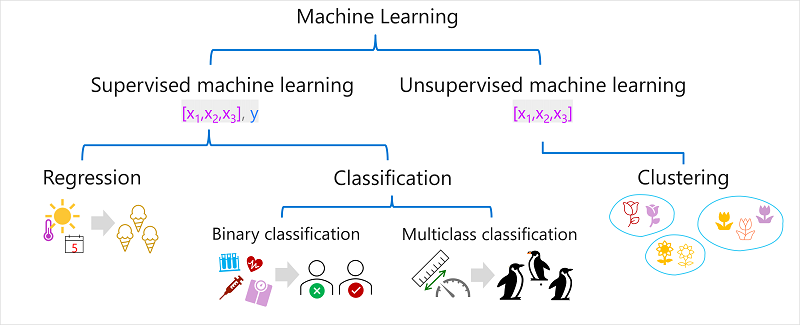

## 3. Supervised Learning Types

### 3.1 Regression (Numeric Prediction)

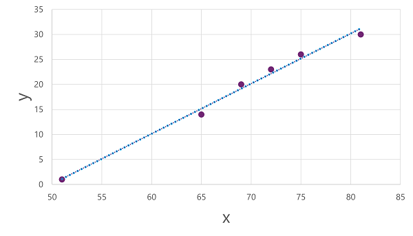

- Predict **continuous numeric** label (y)
      Examples:
      - Price, sales quantity, fuel efficiency, etc.

- Typical process:
      - Split data into train / validation
      - Train model on training set
      - Predict on validation set
      - Compare predicted ŷ vs actual y
      - Repeat with different features/algorithms/hyperparameters

#### Key Regression Metrics

- **MAE (Mean Absolute Error)**:
      Average of |y - ŷ|
      “On average, how far off are we?”

- **MSE (Mean Squared Error)**:
      Average of (y - ŷ)²
      Penalizes large errors more

- **RMSE (Root Mean Squared Error)**:
      √MSE
      Error in original units (e.g., “ice creams”)

- **R² (Coefficient of Determination)**:
      Proportion of variance explained by model
      Range: 0 → 1
      Closer to 1 = better fit

### 3.2 Classification (Categorical Prediction)

- Predict **category / class** label

#### Binary Classification

- Two possible outcomes (e.g., yes/no, 0/1, positive/negative)
- Model outputs **probability** P(y=1 | x)
- Uses logistic/sigmoid-style function:
      probability between 0 and 1
- **Threshold** (often 0.5):
      - ŷ = 1 if P ≥ threshold
      - ŷ = 0 if P < threshold

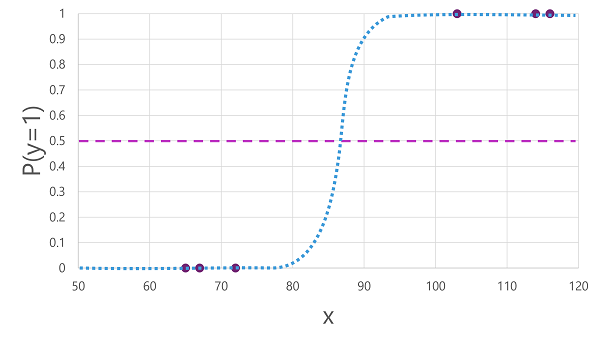

##### Confusion Matrix Terms

- TP (True Positive): predicted 1, actual 1
- TN (True Negative): predicted 0, actual 0
- FP (False Positive): predicted 1, actual 0
- FN (False Negative): predicted 0, actual 1

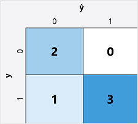

##### Important Metrics

- **Accuracy**:
      (TP + TN) / (TP + TN + FP + FN)
      “Overall, how often correct?”

- **Recall** (Sensitivity, TPR):
      TP / (TP + FN)
      “Of all actual positives, how many did we catch?”

- **Precision**:
      TP / (TP + FP)
      “Of all predicted positives, how many were truly positive?”

- **F1-score**:
      Harmonic mean of precision & recall
      Good when you need balance between precision and recall

- **ROC / AUC**:
      - ROC curve: TPR vs FPR across all thresholds
      - AUC:
            1.0 = perfect
            0.5 = random guessing
            Higher AUC = better classifier overall

## Area Under the Curve (AUC) Example
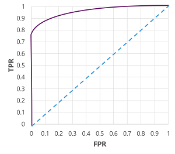

#### Multiclass Classification

- More than two classes (e.g., species: Adelie, Gentoo, Chinstrap)
- Model estimates probability for **each** class; pick the highest

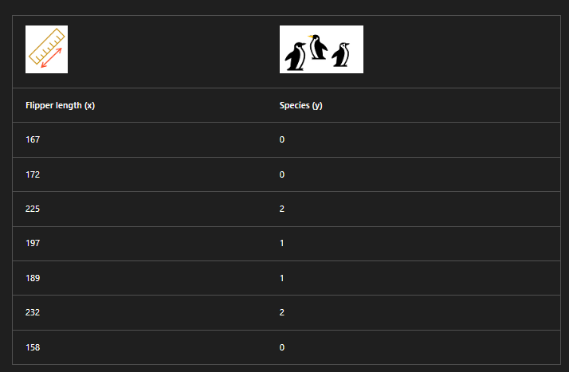

##### Common Approaches

- **One-vs-Rest (OvR)**:
      Train one binary classifier per class
      f0(x) = P(y=0 | x)
      f1(x) = P(y=1 | x)
      f2(x) = P(y=2 | x)
      Predict class with highest probability

- **Multinomial / Softmax**:
      Single function outputs probability vector:
      f(x) = [P(y=0|x), P(y=1|x), P(y=2|x)]
      Probabilities sum to 1

##### Evaluation

- Multiclass **confusion matrix**:
      Rows = actual classes
      Columns = predicted classes

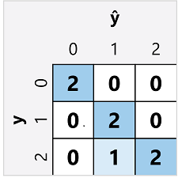

- Can compute:
      - Accuracy
      - Precision / Recall / F1 for each class
      - Overall precision/recall/F1 (aggregate)

## 4. Unsupervised Learning — Clustering

- No labels; groups items by similarity of features

### Clustering Basics

- **Goal**: assign each data point to a cluster
      Cluster label is learned from structure in data

- **Common algorithm: K-Means**

      1. Choose number of clusters **k**
      2. Initialize k random centroids
      3. Assign each point to nearest centroid
      4. Move centroids to mean of their assigned points
      5. Reassign points to nearest centroid
      6. Repeat 4–5 until clusters stabilize or max iterations reached

### Clustering Evaluation (No Labels)

- Measures how well clusters are separated:

      - Average distance to cluster center
      - Average distance to other cluster centers
      - Maximum distance to cluster center
      - **Silhouette score**:
            -1 to 1
            Closer to 1 = better cluster separation

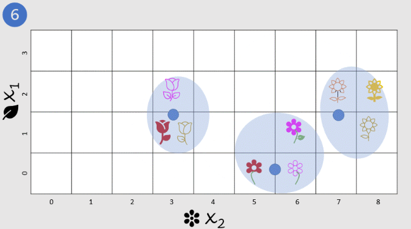

## 5. Deep Learning — Neural Networks

- **Deep learning** = ML with **deep neural networks (DNNs)**
- Inspired by biological neurons, but implemented as math

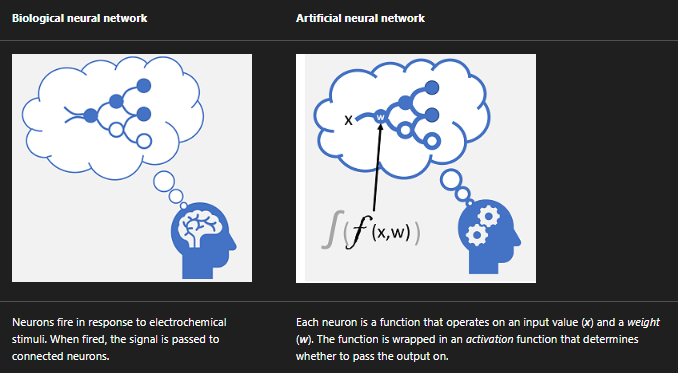

### Neural Network Basics

- A network of **layers**:
      - Input layer (features x)
      - Hidden layers
      - Output layer (predicted y or probability vector)

- Each neuron:
      - Takes inputs x with weights w
      - Computes weighted sum
      - Passes result through **activation function**
      - Decides what signal to pass forward

- Used for:
      - Regression
      - Classification
      - NLP
      - Computer vision
      - Many advanced scenarios

## Example - Using deep learning for classification
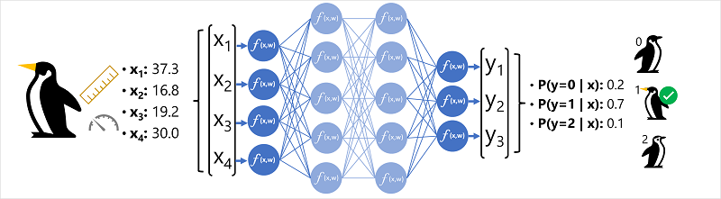

### DNN as Nested Function

- Overall model: ŷ = f(x)
- Internally: many nested functions with weights (w)
- Training learns the best weights to minimize error (loss)

### Training Neural Networks — Key Ideas

1. **Forward pass**:
      - Feed training features (x) through network
      - Compute outputs ŷ

2. **Compute loss**:
      - Compare ŷ vs actual y with a loss function
      - Higher loss = worse predictions

3. **Backpropagation + Gradient Descent**:
      - Compute how each weight w affects the loss
      - Adjust weights w up/down to reduce loss
      - This is gradient descent-based optimization

4. **Iterate over epochs**:
      - Repeat forward pass + backprop many times
      - Use batches of training data
      - Stop when loss is acceptably low / performance is good

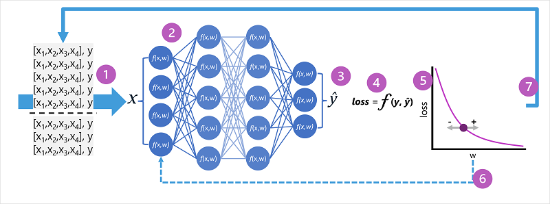

### Hardware Note

- Training DNNs uses **vector/matrix math**
- Often runs on **GPUs** for speed and efficiency

## 6. High-Level Summary (Exam-Speed Recall)

- Model = f(x) → y; training = learn f; inferencing = use f
- Supervised:
      - Regression → numeric y (MAE, MSE, RMSE, R²)
      - Classification → categorical y
            - Binary: confusion matrix, accuracy, precision, recall, F1, AUC
            - Multiclass: OvR or softmax, multiclass confusion matrix
- Unsupervised:
      - Clustering (e.g., K-Means): no labels, group by similarity, silhouette score
- Deep learning:
      - Neural networks with layers & weights
      - Train via forward pass, loss, backprop, gradient descent
      - Great for complex tasks (vision, NLP, etc.)
