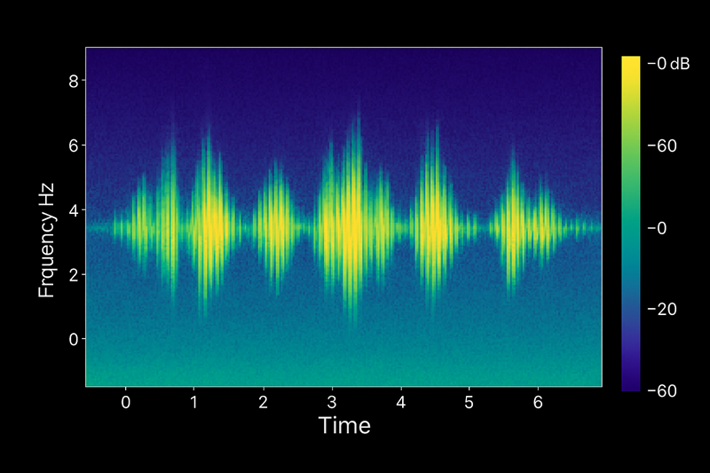
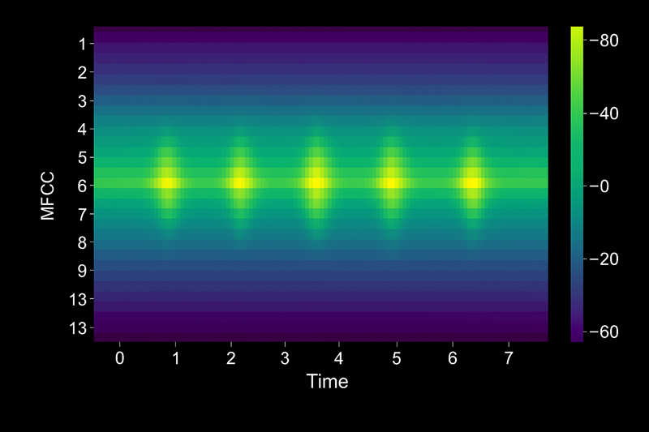
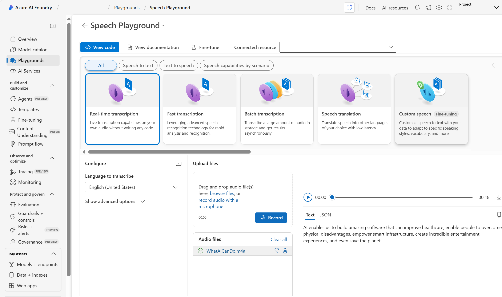

# AI-900 — Speech-Enabled Solutions (Condensed Notes)

## 1. Speech-Enabled Solutions (Big Picture)

- **Speech recognition (STT)**: audio → text
- **Speech synthesis (TTS)**: text → audio

### Why Use Speech

- **Accessibility**: helps visually impaired / mobility-challenged users
- **Productivity**: hands-free, multitasking
- **User experience**: more natural, conversational interfaces
- **Global reach**: multiple languages and dialects

### Common STT Scenarios

- **Customer service & support**
      - Live call transcription
      - Auto-routing based on spoken intent
      - Sentiment analysis & issue trends
      - Searchable call records (compliance, QA)

- **Voice assistants & agents**
      - Voice commands (apps, devices, vehicles, smart home)
      - Natural language Q&A
      - Task automation (reminders, messages, search)

- **Meetings & interviews**
      - Meeting notes + action items
      - Real-time captions (accessibility)
      - Summaries and key points extraction

- **Healthcare documentation**
      - Dictation into EHR
      - Real-time note capture
      - Reduces admin burden, improves detail accuracy

### Common TTS Scenarios

- **Conversational AI / chatbots**
      - Spoken responses instead of text-only
      - Adjustable tone, pace, style
      - Consistent voice brand across channels

- **Accessibility & content consumption**
      - Read web pages, docs, articles aloud
      - Support for users with dyslexia / reading difficulties
      - Listening while driving, exercising, etc.

- **Notifications & alerts**
      - Spoken alerts, reminders, status updates
      - GPS navigation instructions
      - Audible alerts in industrial environments

- **E-learning & training**
      - Narrated lessons without studio recording
      - Pronunciation examples (language learning)
      - Audio versions of training content

- **Entertainment & media**
      - Character voices, voiceovers, prototypes
      - Personalized audio content at scale

### Combined STT + TTS Scenarios

- Voice customer service (IVR)
- Interactive voice agents
- Language learning apps (speak + feedback)
- Voice-controlled vehicles & devices

### Key Implementation Considerations

- **Audio quality**: noise, mic quality, distance
- **Language/dialect support**
- **Privacy & compliance**: storage, processing, regulations
- **Latency**:
      - Real-time → low latency required
      - Offline/batch → latency less critical
- **Accessibility**:
      - Always provide **non-speech alternatives** (text UI, captions)

## 2. Speech Recognition (STT) — Pipeline

> Goal: Convert speech audio → text using multiple stages.

### Stage 1 — Audio Capture

- Microphone converts sound → **digital signal**
- Typical sampling: **16 kHz** for speech
- Optional pre-filtering:
      - Remove hum, clicks, basic background noise

### Stage 2 — Pre-processing & Feature Extraction

- Raw waveform is too large → extract **features** that describe speech
- Common technique: **MFCC (Mel-Frequency Cepstral Coefficients)**
      - Split into short frames (20–30 ms, overlapping)
      - Fourier transform → frequency domain
      - Map to **Mel scale** (human hearing)
      - Extract small vector (~13 coefficients) per frame
- Output: sequence of feature vectors (one per frame)

### Stage 3 — Acoustic Modeling (Audio → Phonemes)

- **Acoustic model** maps feature vectors → **phoneme probabilities**
- Today often uses **transformer-based** deep models
      - Attention looks at context across frames
      - Handles differences in pronunciation depending on position
- Output: for each time frame, probability distribution over phonemes
      - Example: frame → 80% /æ/, 15% /ɛ/, 5% others

### Stage 4 — Language Modeling (Phonemes → Words)

- **Language model** uses:
      - Vocabulary
      - Grammar
      - Statistical patterns (word sequences)
- Resolves homophones:
      - “their” vs “there” vs “they’re”
- Can be domain-adapted:
      - Medical, legal, financial vocabulary

### Stage 5 — Decoding (Best Text Hypothesis)

- Combine acoustic + language model outputs
- Common method: **beam search**
      - Maintain top N partial hypotheses
      - Extend with likely next words
      - Prune low-scoring paths
- Goal: choose text that best fits audio + language patterns
      - E.g., “Please send the report by Friday” over similar alternatives

### Stage 6 — Post-processing

- Clean up raw transcript:
      - Capitalization
      - Punctuation restoration
      - Numbers (“one thousand” → 1,000)
      - Profanity filtering (if needed)
      - Normalization (“three p m” → “3 PM”)
- Provide metadata:
      - Timestamps
      - Confidence scores (flag low-confidence sections)

### Summary — STT Flow

- Audio → features (MFCC) → phonemes (acoustic model) → words (language model) → best sequence (decoder) → polished text (post-processing)

## 3. Speech Synthesis (TTS) — Pipeline

> Goal: Convert text → natural-sounding audio.

### Stage 1 — Text Normalization

- Convert raw text into **spoken form**:
      - Abbreviations: “Dr.” → “Doctor”
      - Numbers: “3” → “three”
      - Currency: “$25.50” → “twenty-five dollars and fifty cents”
      - Dates: “12/15/2023” → “December fifteenth, two thousand twenty-three”
      - Symbols: “@” → “at”, etc.
- Avoids trying to pronounce raw symbols/digits directly.

### Stage 2 — Linguistic Analysis (Text → Phonemes)

- Split text into:
      - Words, syllables
      - Apply lexicons + rules/ML for pronunciation
- **Grapheme-to-phoneme (G2P)**:
      - Maps spelling → sounds (phonemes)
      - Uses neural models + pronunciation dictionaries
- Handles:
      - Irregular spellings (“though”, “through”, “cough”)
      - Unknown words / names
      - Context-dependent words (“read” present vs past)

### Stage 3 — Prosody Generation (How to Say It)

- **Prosody** = rhythm, stress, intonation:
      - Pitch (contours)
      - Duration (how long sounds last)
      - Intensity (loudness)
      - Pauses
- Strong influence on **naturalness** and meaning
- Often predicted using **transformer models**:
      - Input: phoneme sequence + sentence structure
      - Output: pitch, duration, energy per phoneme
- Factors:
      - Syntax (clause boundaries → pauses)
      - Emphasis / semantics (important words stressed)
      - Speaker style (neutral vs expressive)
      - Emotional tone (excited, calm, etc.)

### Stage 4 — Waveform Generation (Vocoding)

- Convert phonemes + prosody → final audio waveform
- Modern approach: **neural vocoders** (WaveNet, HiFi-GAN, etc.)
      - High-fidelity, natural audio
      - Real-time generation
- Typical flow:
      - Acoustic model → **mel-spectrogram**
      - Vocoder → waveform samples (16–48 kHz)
      - Optional post-processing (normalization, filtering)

### Summary — TTS Flow

- Text → normalized text → phonemes + linguistic features → prosody (pitch, duration, stress) → mel-spectrogram → neural vocoder → audio waveform

## 4. Exam-Ready Quick Recap

- **STT**:
      - Speech → text through:
            - Audio capture
            - MFCC feature extraction
            - Acoustic model (phonemes)
            - Language model (words)
            - Decoder (beam search)
            - Post-processing (formatting, confidence)

- **TTS**:
      - Text → speech through:
            - Text normalization
            - Linguistic analysis + G2P (phonemes)
            - Prosody prediction (pitch/rhythm/stress)
            - Neural vocoder (waveform generation)

- **Business uses**:
      - Customer service, voice agents, meetings, healthcare, accessibility, notifications, training, media

- **Key considerations**:
      - Audio quality, language support, privacy, latency, accessibility
      - Always keep **non-speech** input/output options available

# AI-900 — Azure Speech (Recognition, Synthesis & Azure Service)

## 1. Speech Recognition vs Speech Synthesis

### Speech Recognition (STT)

- Goal: **audio → text / data**
- Input:
      - Live mic audio
      - Recorded audio files
- Core models:
      - **Acoustic model** → audio → phonemes (sounds)
      - **Language model** → phonemes → words (most probable word sequence)
- Typical usages:
      - Closed captions (live or recorded video)
      - Transcripts of calls/meetings
      - Voice dictation (notes, docs)
      - Voice as input to apps/agents (commands, queries)

### Speech Synthesis (TTS)

- Goal: **text → spoken audio**
- Needs:
      - Text to speak
      - Voice (speaker) to use
- Process (conceptual):
      - Tokenize text → words
      - Assign phonetic sounds → words
      - Group into prosodic units (phrases/clauses/sentences)
      - Create phonemes + prosody (rate, pitch, volume)
      - Synthesize to audio using selected voice
- Typical usages:
      - Spoken responses in apps/agents
      - Phone IVR menus
      - Reading emails/texts hands-free
      - Announcements (airports, stations, public PA)

---

## 2. Azure Speech Service — Capabilities

- **Azure Speech service** supports:
      - **Speech to Text** (STT)
      - **Text to Speech** (TTS)
      - **Speech Translation** (speech → translated text/speech)
- Backed by Microsoft’s **Universal Language Model**
      - Optimized for:
            - **Conversational** scenarios
            - **Dictation**
      - Can be customized:
            - Acoustic model
            - Language model
            - Pronunciation model

---

## 3. Speech to Text (Azure STT)

### Real-time Transcription

- Use case: live presentations, demos, streams, meetings, assistants
- App responsibilities:
      - Capture audio (mic or streamed audio)
      - Stream audio to Azure Speech API
      - Receive transcribed text in real time

### Batch Transcription

- Use case: stored recordings (call archives, lectures, podcasts)
- Input:
      - Audio files (e.g., in Azure Storage)
      - Referenced via **SAS URI**
- Execution:
      - Jobs run **asynchronously** (best-effort scheduling)
      - No exact start-time guarantee
      - App polls or receives results when transcription completes

---

## 4. Text to Speech (Azure TTS)

- Converts **text → audible speech**
      - Can play directly from app
      - Or save to audio file (e.g., for later playback)

### Voices

- **Predefined voices**:
      - Multiple languages + regional accents
      - Includes **neural voices**:
            - More natural intonation
            - Human-like prosody
- **Custom voices**:
      - Train a voice that matches brand or specific persona
      - Then use it via TTS API

---

## 5. Speech Translation (Azure Speech Translation)

- Pipeline:
      1. **ASR**: Speech → text (source language)
      2. **Machine Translation**: Source text → target language(s)
      3. Output:
            - Translated **text**
            - Or **synthesized speech** in target language
- Supports:
      - Many source and target languages
- Integration:
      - Via **REST APIs** or **SDKs**
- Example scenarios:
      - Multilingual meetings
      - Live event captions with translation
      - Global customer support

---

## 6. Using Azure Speech — Tools & Resources

### Access Methods

- **Studio interfaces**
      - Use **Microsoft Foundry → Speech Playground** for:
            - Quick testing
            - Prototyping prompts & audio
- **CLI**
      - Scripted workflows, automation/testing
- **REST APIs & SDKs**
      - Integrate into apps:
            - STT
            - TTS
            - Translation

### Azure Resources for Speech

- To use Speech in Azure, create **one** of:

1. **Speech resource**
      - Use when:
            - Only need Azure Speech
            - Want separate access/billing just for Speech

2. **Foundry Tools resource**
      - Use when:
            - Speech will be used **with other Foundry Tools**
            - Want unified access/billing across Foundry services

